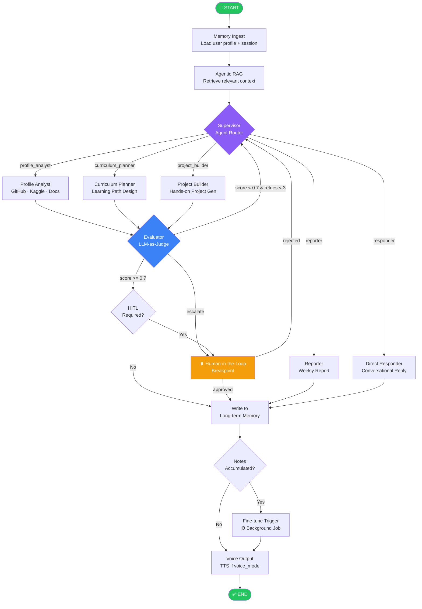

# Personalized AI Learning & Career Coach — Complete Architecture & Implementation Documentation

> **Version:** 2.0 (2026 Edition) | **Stack:** LangGraph v1.1.x · CrewAI v1.12 · Ollama · ChromaDB · Chainlit · Whisper · Kokoro TTS  
> **License:** All referenced tools are open-source (MIT / Apache-2.0)  
> **Target Audience:** Engineering teams ready to implement within days, not months.

---

## Table of Contents

1. [System Overview](#1-system-overview)
2. [Architecture Philosophy & Framework Rationale](#2-architecture-philosophy--framework-rationale)
3. [Prerequisites & Environment Setup](#3-prerequisites--environment-setup)
4. [Project Structure](#4-project-structure)
5. [State Schema & Data Models](#5-state-schema--data-models)
6. [Agent Roster & Role Definitions](#6-agent-roster--role-definitions)
7. [Graph Architecture & Cognitive Loops](#7-graph-architecture--cognitive-loops)
8. [Memory Architecture](#8-memory-architecture)
9. [Agentic RAG Pipeline](#9-agentic-rag-pipeline)
10. [Tool & MCP Interface Design](#10-tool--mcp-interface-design)
11. [Voice Interface (STT + TTS)](#11-voice-interface-stt--tts)
12. [Ollama Fine-Tuning Pipeline](#12-ollama-fine-tuning-pipeline)
13. [Chainlit UI Integration](#13-chainlit-ui-integration)
14. [Human-in-the-Loop (HITL) Breakpoints](#14-human-in-the-loop-hitl-breakpoints)
15. [Governance, Guardrails & Self-Healing](#15-governance-guardrails--self-healing)
16. [Observability & Logging](#16-observability--logging)
17. [Weekly Report Generation](#17-weekly-report-generation)
18. [Deployment Guide](#18-deployment-guide)
19. [Risk & Optimization Report](#19-risk--optimization-report)
20. [Troubleshooting](#20-troubleshooting)
21. [Glossary](#21-glossary)

---

## 1. System Overview

### What This System Does

The **Personalized AI Learning & Career Coach** is a production-grade multi-agent system that provides each user with a private, adaptive learning companion. The system:

- **Ingests** a user's GitHub profile, Kaggle notebooks, uploaded documents, and session notes
- **Analyzes** skill gaps against a target role or technology track
- **Plans** a dynamic, week-by-week learning path with curated resources
- **Generates** hands-on practice projects tailored to the user's current level
- **Fine-tunes** a local Ollama-served LLM on the user's own notes and progress for hyper-personalized responses
- **Reports** weekly progress with metrics, next-step recommendations, and motivational framing
- **Speaks** — a full duplex voice interface allows hands-free interaction

### High-Level System Map

```
┌─────────────────────────────────────────────────────────────────┐
│                        USER INTERFACE                           │
│          Chainlit Web UI  ◄──────────►  Voice (STT / TTS)      │
└────────────────────────┬────────────────────────────────────────┘
                         │
┌────────────────────────▼────────────────────────────────────────┐
│                   LANGGRAPH ORCHESTRATOR                        │
│   StateGraph  ►  Supervisor Agent  ►  Conditional Router        │
│   Checkpointing (SQLite/Postgres)  ►  HITL Breakpoints         │
└────────┬──────────┬──────────┬──────────┬──────────────────────┘
         │          │          │          │
    ┌────▼───┐ ┌────▼───┐ ┌───▼────┐ ┌───▼──────┐
    │Profile  │ │Curriculum│ │Project │ │Evaluator │
    │Analyst  │ │Planner  │ │Builder │ │  Agent   │
    │ Agent   │ │ Agent   │ │ Agent  │ │(LLM Judge│
    └────┬────┘ └────┬────┘ └───┬────┘ └───┬──────┘
         │          │          │           │
┌────────▼──────────▼──────────▼───────────▼──────────────────────┐
│                    SHARED INFRASTRUCTURE                         │
│   Agentic RAG (ChromaDB)  ·  Ollama Fine-tuned Model           │
│   Long-term Memory (SQLite/Qdrant)  ·  Tool Registry (MCP)     │
└─────────────────────────────────────────────────────────────────┘
```

---

## 2. Architecture Philosophy & Framework Rationale

### Why LangGraph (Primary Orchestrator)

LangGraph v1.1.x is chosen as the primary orchestration layer for the following reasons, each backed by 2026 production evidence:

| Criterion | LangGraph | CrewAI | Decision |
|-----------|-----------|--------|----------|
| State persistence & checkpointing | ✅ Native (SQLite/Postgres) | ❌ Manual | LangGraph |
| HITL breakpoints | ✅ Built-in interrupt/resume | ⚠️ Limited | LangGraph |
| Conditional routing | ✅ First-class via `add_conditional_edges` | ⚠️ Sequential default | LangGraph |
| Role-based agent definition | ⚠️ Requires boilerplate | ✅ First-class Crew/Task | CrewAI |
| Rapid agent prototyping | ⚠️ Verbose | ✅ Excellent | CrewAI |
| Debugging / observability | ✅ LangSmith native | ⚠️ Limited | LangGraph |

**Decision:** Use **LangGraph as the orchestration backbone** (state machine, routing, checkpointing, HITL) and **CrewAI agent definitions** for role-rich agents (Profile Analyst, Curriculum Planner, Project Builder). CrewAI v1.12 now supports Ollama natively as an OpenAI-compatible provider, making the local-first stack seamless.

### Cognitive Architecture: ReAct + Reflection Loop

Every agent in the system implements the **ReAct** (Reason + Act) loop with an additional **Reflection** node:

```
Thought → Action (Tool Call) → Observation → Reflection → Thought → …
```

This prevents agents from blindly accepting poor tool results. The Reflection step is implemented as a separate LangGraph node that can route back for retry or escalate to the Evaluator Agent.

---

## 3. Prerequisites & Environment Setup

### Hardware Requirements

| Component | Minimum | Recommended |
|-----------|---------|-------------|
| CPU | 8 cores | 16+ cores |
| RAM | 16 GB | 32 GB |
| GPU (for fine-tuning) | NVIDIA 8 GB VRAM | NVIDIA 24 GB VRAM |
| Disk | 50 GB | 200 GB SSD |
| OS | Ubuntu 22.04 LTS | Ubuntu 24.04 LTS |

> **Note:** The inference stack (Ollama + Chainlit) runs CPU-only on a modern 16-core machine with degraded latency. Fine-tuning **requires** a GPU or a cloud instance (Colab, Vast.ai).

### Software Prerequisites

```bash
# Python 3.11 is required (3.12 has compatibility issues with some CrewAI deps as of May 2026)
python --version   # should show 3.11.x

# System packages
sudo apt-get update && sudo apt-get install -y \
    build-essential \
    portaudio19-dev \     # for voice input
    ffmpeg \              # for audio processing
    git \
    curl

# Install Ollama
curl -fsSL https://ollama.ai/install.sh | sh
ollama serve &   # start in background

# Pull base models (do this before pip installs — large downloads)
ollama pull llama3.2:3b-instruct-q4_K_M   # fast responses, personalization model
ollama pull llama3.1:8b-instruct-q4_K_M   # reasoning tasks
ollama pull nomic-embed-text               # embeddings
```

### Python Environment

```bash
# Create and activate virtual environment
python3.11 -m venv .venv
source .venv/bin/activate

# Pin pip to avoid resolver surprises
pip install pip==24.3.1 setuptools==75.1.0
```

### `requirements.txt` (Version-Pinned)

```text
# Orchestration
langgraph==1.1.3
langchain==1.0.3
langchain-community==0.3.9
langchain-ollama==0.3.1
langchain-core==0.3.25

# Agent framework
crewai==1.12.0
crewai-tools==0.28.0

# Vector database & RAG
chromadb==0.6.3
sentence-transformers==3.4.1

# Memory persistence
sqlalchemy==2.0.36

# UI
chainlit==2.4.0

# Voice interface
openai-whisper==20240930         # STT — runs locally
kokoro-onnx==0.4.1               # TTS — ONNX-based, CPU-friendly
pyaudio==0.2.14
sounddevice==0.5.0

# Fine-tuning
transformers==4.47.0
peft==0.14.0
trl==0.12.0
bitsandbytes==0.44.1
unsloth==2025.3.19               # 2x faster, 70% less VRAM
datasets==3.2.0
accelerate==1.2.1

# Observability
langsmith==0.2.3
opentelemetry-sdk==1.28.0
opentelemetry-exporter-otlp==1.28.0
prometheus-client==0.21.0

# Data ingestion
PyGithub==2.5.0
kaggle==1.6.17
httpx==0.27.2

# Utilities
pydantic==2.10.3
python-dotenv==1.0.1
tenacity==9.0.0
rich==13.9.4
schedule==1.2.2
```

```bash
pip install -r requirements.txt
```

### Environment Variables (`.env`)

```ini
# ── Model configuration ──────────────────────────────────────────
OLLAMA_BASE_URL=http://localhost:11434
ORCHESTRATOR_MODEL=llama3.1:8b-instruct-q4_K_M
PERSONALIZATION_MODEL=coach-personal-v1   # your fine-tuned model name
EMBEDDING_MODEL=nomic-embed-text

# ── API keys (external services — optional if fully local) ────────
GITHUB_TOKEN=ghp_xxxxxxxxxxxxxxxxxxxx
KAGGLE_USERNAME=your_username
KAGGLE_KEY=your_key

# ── Persistence ──────────────────────────────────────────────────
CHROMA_PERSIST_DIR=./data/chroma
SQLITE_DB_PATH=./data/coach.db
CHECKPOINTER_DB_URI=sqlite:///./data/checkpoints.db

# ── Observability (optional LangSmith) ──────────────────────────
LANGCHAIN_TRACING_V2=true
LANGCHAIN_ENDPOINT=https://api.smith.langchain.com
LANGCHAIN_API_KEY=ls_xxxxxxxxxxxx
LANGCHAIN_PROJECT=ai-coach-prod

# ── Voice ────────────────────────────────────────────────────────
WHISPER_MODEL=base.en           # runs locally
TTS_VOICE=af_sky                # Kokoro voice ID
TTS_SPEED=1.0

# ── Chainlit ─────────────────────────────────────────────────────
CHAINLIT_AUTH_SECRET=change_me_in_production
```

---

## 4. Project Structure

```
ai-coach/
├── .env
├── requirements.txt
├── README.md
│
├── src/
│   ├── __init__.py
│   │
│   ├── state/
│   │   ├── __init__.py
│   │   └── schema.py             # TypedDict state, Pydantic models
│   │
│   ├── agents/
│   │   ├── __init__.py
│   │   ├── supervisor.py         # LangGraph supervisor node
│   │   ├── profile_analyst.py    # CrewAI Agent: GitHub/Kaggle analysis
│   │   ├── curriculum_planner.py # CrewAI Agent: learning path design
│   │   ├── project_builder.py    # CrewAI Agent: project generation
│   │   ├── evaluator.py          # LLM-as-Judge evaluator node
│   │   └── reporter.py           # Weekly report generator
│   │
│   ├── graph/
│   │   ├── __init__.py
│   │   ├── builder.py            # StateGraph construction
│   │   ├── nodes.py              # All graph node functions
│   │   ├── edges.py              # Conditional routing logic
│   │   └── checkpointer.py      # SQLite persistence setup
│   │
│   ├── memory/
│   │   ├── __init__.py
│   │   ├── short_term.py         # In-graph message window
│   │   ├── long_term.py          # SQLite user profile store
│   │   └── vector_store.py       # ChromaDB RAG store
│   │
│   ├── rag/
│   │   ├── __init__.py
│   │   ├── ingestion.py          # Document ingestion pipeline
│   │   ├── retriever.py          # Adaptive retriever
│   │   └── sources/
│   │       ├── github_loader.py
│   │       ├── kaggle_loader.py
│   │       └── document_loader.py
│   │
│   ├── tools/
│   │   ├── __init__.py
│   │   ├── registry.py           # Central tool registry
│   │   ├── github_tools.py
│   │   ├── kaggle_tools.py
│   │   ├── web_search_tool.py    # DuckDuckGo (open-source)
│   │   ├── resource_finder.py
│   │   └── code_executor.py
│   │
│   ├── voice/
│   │   ├── __init__.py
│   │   ├── stt.py                # Whisper STT
│   │   └── tts.py                # Kokoro TTS
│   │
│   ├── finetune/
│   │   ├── __init__.py
│   │   ├── data_prep.py          # Convert user notes → training pairs
│   │   ├── trainer.py            # Unsloth + PEFT LoRA fine-tuning
│   │   ├── export.py             # GGUF export + Ollama Modelfile
│   │   └── scheduler.py          # Trigger weekly fine-tuning runs
│   │
│   ├── ui/
│   │   ├── app.py                # Chainlit entrypoint
│   │   ├── callbacks.py          # Message handlers
│   │   └── components.py         # Custom Chainlit elements
│   │
│   └── observability/
│       ├── __init__.py
│       ├── tracer.py             # OpenTelemetry setup
│       └── metrics.py            # Prometheus metrics
│
├── data/
│   ├── chroma/                   # Vector store (git-ignored)
│   ├── checkpoints.db            # LangGraph state checkpoints
│   ├── coach.db                  # User profiles, progress
│   └── training/                 # Fine-tuning datasets
│
├── scripts/
│   ├── ingest_user.py            # One-time profile ingestion
│   ├── run_finetune.py           # Manual fine-tune trigger
│   └── generate_report.py        # Manual report trigger
│
└── tests/
    ├── unit/
    ├── integration/
    └── evals/
        └── agent_trajectories.py  # LangSmith evals
```

---

## 5. State Schema & Data Models

The `CoachState` TypedDict is the single source of truth flowing through every node in the LangGraph graph. Every agent reads from and writes to this object.

```python
# src/state/schema.py

from __future__ import annotations
from typing import Annotated, Any, Optional
from typing_extensions import TypedDict
from pydantic import BaseModel, Field
from datetime import datetime
from langgraph.graph import add_messages
from langchain_core.messages import BaseMessage


# ─────────────────────────────────────────────
# Sub-models (Pydantic for validation at edges)
# ─────────────────────────────────────────────

class UserProfile(BaseModel):
    """Persisted user profile — read from long-term memory at session start."""
    user_id: str
    name: str
    target_role: str                        # e.g. "ML Engineer", "Data Scientist"
    current_skills: list[str] = []
    skill_gaps: list[str] = []
    completed_topics: list[str] = []
    learning_velocity: float = 1.0          # multiplier: 0.5 slow, 1.0 avg, 2.0 fast
    preferred_resources: list[str] = []     # "video", "paper", "hands-on"
    github_username: Optional[str] = None
    kaggle_username: Optional[str] = None
    session_count: int = 0
    last_session: Optional[datetime] = None


class LearningPlan(BaseModel):
    """Structured learning plan produced by Curriculum Planner."""
    weeks: list[dict[str, Any]] = []        # [{week: 1, topic: "...", resources: [...]}]
    current_week: int = 1
    milestones: list[str] = []
    estimated_completion_days: int = 90


class PracticeProject(BaseModel):
    """A generated practice project from Project Builder."""
    title: str
    description: str
    difficulty: str                          # "beginner", "intermediate", "advanced"
    tech_stack: list[str]
    starter_code_outline: str
    evaluation_criteria: list[str]
    estimated_hours: int


class EvaluationResult(BaseModel):
    """LLM-as-Judge evaluation output."""
    score: float                             # 0.0 – 1.0
    passed: bool
    feedback: str
    retry_recommended: bool
    escalate_to_human: bool = False


class AgentHandover(BaseModel):
    """Structured handover schema between agents."""
    from_agent: str
    to_agent: str
    summary: str                             # What was accomplished
    context_payload: dict[str, Any]          # Data to pass forward
    timestamp: datetime = Field(default_factory=datetime.utcnow)


# ─────────────────────────────────────────────
# Main State Object
# ─────────────────────────────────────────────

class CoachState(TypedDict):
    # ── Conversation ──────────────────────────
    messages: Annotated[list[BaseMessage], add_messages]   # LangGraph reducer
    user_input: str
    voice_mode: bool

    # ── User context ──────────────────────────
    user_profile: UserProfile
    session_id: str
    is_new_user: bool

    # ── Agent outputs ─────────────────────────
    learning_plan: Optional[LearningPlan]
    current_project: Optional[PracticeProject]
    evaluation: Optional[EvaluationResult]
    weekly_report: Optional[str]

    # ── Routing & control ─────────────────────
    next_agent: str                          # Supervisor sets this
    iteration_count: int                     # Cycle guard
    max_iterations: int                      # Default: 5

    # ── RAG context ───────────────────────────
    retrieved_docs: list[dict[str, Any]]
    rag_query: str

    # ── HITL ──────────────────────────────────
    hitl_required: bool
    hitl_prompt: str
    human_approval: Optional[bool]

    # ── Handovers ─────────────────────────────
    handover_log: list[AgentHandover]

    # ── Fine-tuning signals ───────────────────
    new_notes: list[str]                    # User notes collected this session
    finetune_trigger: bool                  # Set True when enough data accumulates

    # ── Error tracking ────────────────────────
    error_count: int
    last_error: Optional[str]
```

---

## 6. Agent Roster & Role Definitions

### 6.1 Supervisor Agent (LangGraph Node)

The Supervisor is a **pure LangGraph node** — not a CrewAI agent. It reads the current state and decides which specialist agent handles the next step.

```python
# src/agents/supervisor.py

from langchain_ollama import ChatOllama
from langchain_core.prompts import ChatPromptTemplate
from src.state.schema import CoachState

SUPERVISOR_SYSTEM = """You are the orchestration supervisor for an AI learning coach system.
Given the conversation history and the current user profile, decide which specialist agent 
should handle the next action. 

Available agents:
- profile_analyst   : Analyze GitHub/Kaggle/uploaded data; extract skills
- curriculum_planner: Design or update a personalized learning path
- project_builder   : Generate a hands-on practice project
- evaluator         : Assess the quality of a plan or project
- reporter          : Generate the weekly progress report
- responder         : Directly respond to the user (no specialist needed)

Respond with ONLY the agent name. No explanation."""

def supervisor_node(state: CoachState) -> CoachState:
    """Routes to the appropriate specialist based on current state."""
    llm = ChatOllama(model="llama3.1:8b-instruct-q4_K_M", temperature=0)
    prompt = ChatPromptTemplate.from_messages([
        ("system", SUPERVISOR_SYSTEM),
        ("human", "User said: {user_input}\n\nCurrent phase: {phase}\n\nRoute to:"),
    ])
    chain = prompt | llm
    result = chain.invoke({
        "user_input": state["user_input"],
        "phase": _detect_phase(state),
    })
    next_agent = result.content.strip().lower()

    # Cycle guard
    if state["iteration_count"] >= state["max_iterations"]:
        next_agent = "responder"

    return {
        **state,
        "next_agent": next_agent,
        "iteration_count": state["iteration_count"] + 1,
    }


def _detect_phase(state: CoachState) -> str:
    """Heuristic: determine what phase the user is in."""
    if state["is_new_user"] or not state["user_profile"].current_skills:
        return "onboarding"
    if state["learning_plan"] is None:
        return "planning"
    if state["user_profile"].session_count % 7 == 0:
        return "weekly_report"
    return "active_learning"
```

### 6.2 Profile Analyst Agent (CrewAI)

```python
# src/agents/profile_analyst.py

from crewai import Agent, Task, Crew
from crewai_tools import tool
from src.tools.github_tools import analyze_github_profile
from src.tools.kaggle_tools import analyze_kaggle_notebooks
from src.state.schema import CoachState, UserProfile

profile_analyst = Agent(
    role="Expert Developer Profile Analyst",
    goal=(
        "Extract a precise, honest picture of the user's current technical skill level "
        "by analyzing their GitHub repositories, commit history, Kaggle notebooks, "
        "language usage patterns, and any uploaded documents. "
        "Identify both demonstrated strengths and clear skill gaps relative to the target role."
    ),
    backstory=(
        "You are a senior tech recruiter and engineering mentor with 15 years of experience "
        "evaluating developer portfolios at FAANG companies. You have an uncanny ability to "
        "distinguish between copy-paste code and genuine understanding. You are fair, thorough, "
        "and specific — you never say 'you need to improve Python' without citing which exact "
        "patterns are missing from their work."
    ),
    tools=[analyze_github_profile, analyze_kaggle_notebooks],
    llm="ollama/llama3.1:8b-instruct-q4_K_M",   # CrewAI v1.12 Ollama provider
    verbose=True,
    max_iter=3,
    allow_delegation=False,
)


def run_profile_analyst(state: CoachState) -> CoachState:
    """LangGraph node that invokes the Profile Analyst crew."""
    task = Task(
        description=(
            f"Analyze the profile for user '{state['user_profile'].name}'. "
            f"GitHub: {state['user_profile'].github_username or 'not provided'}. "
            f"Kaggle: {state['user_profile'].kaggle_username or 'not provided'}. "
            f"Target role: {state['user_profile'].target_role}. "
            "Return a structured JSON with: current_skills (list), skill_gaps (list), "
            "strengths (list), and recommended_starting_level (beginner/intermediate/advanced)."
        ),
        expected_output="JSON object with current_skills, skill_gaps, strengths, starting_level",
        agent=profile_analyst,
    )
    crew = Crew(agents=[profile_analyst], tasks=[task], verbose=False)
    result = crew.kickoff()

    # Parse CrewAI output and update state
    import json, re
    raw = result.raw
    json_match = re.search(r'\{.*\}', raw, re.DOTALL)
    if json_match:
        parsed = json.loads(json_match.group())
        updated_profile = state["user_profile"].model_copy(update={
            "current_skills": parsed.get("current_skills", []),
            "skill_gaps":     parsed.get("skill_gaps", []),
        })
        return {**state, "user_profile": updated_profile, "is_new_user": False}
    return state
```

### 6.3 Curriculum Planner Agent (CrewAI)

```python
# src/agents/curriculum_planner.py

from crewai import Agent, Task, Crew
from src.tools.resource_finder import find_learning_resources
from src.tools.web_search_tool import duckduckgo_search
from src.state.schema import CoachState, LearningPlan

curriculum_planner = Agent(
    role="Adaptive Curriculum Designer & Learning Path Architect",
    goal=(
        "Design a personalized, week-by-week learning roadmap that efficiently bridges "
        "the user's current skill level to their target role. Prioritize hands-on resources, "
        "respect the user's preferred learning style, and adapt the pace to their learning velocity."
    ),
    backstory=(
        "You are a former university professor turned EdTech curriculum designer with deep expertise "
        "in spaced repetition, the Feynman technique, and project-based learning. You've designed "
        "curricula for 50,000+ learners across bootcamps and corporate training programs. "
        "You know that the best path is never a straight line — you sequence topics to build "
        "intuition before formalism, and always anchor abstract concepts in concrete projects."
    ),
    tools=[find_learning_resources, duckduckgo_search],
    llm="ollama/llama3.1:8b-instruct-q4_K_M",
    verbose=True,
    max_iter=4,
    allow_delegation=False,
)


def run_curriculum_planner(state: CoachState) -> CoachState:
    """LangGraph node that invokes the Curriculum Planner crew."""
    profile = state["user_profile"]
    rag_context = "\n".join([d.get("content", "") for d in state["retrieved_docs"][:5]])

    task = Task(
        description=(
            f"Design a {90}-day personalized learning plan for {profile.name}. "
            f"Target role: {profile.target_role}. "
            f"Current skills: {', '.join(profile.current_skills)}. "
            f"Gaps to close: {', '.join(profile.skill_gaps)}. "
            f"Preferred resources: {', '.join(profile.preferred_resources) or 'any'}. "
            f"Learning velocity multiplier: {profile.learning_velocity}. "
            f"Relevant course context from knowledge base:\n{rag_context}\n\n"
            "Output a JSON LearningPlan with: weeks (array of week objects with topic, "
            "resources, project_hint), milestones, estimated_completion_days."
        ),
        expected_output="JSON LearningPlan object",
        agent=curriculum_planner,
    )
    crew = Crew(agents=[curriculum_planner], tasks=[task], verbose=False)
    result = crew.kickoff()

    import json, re
    raw = result.raw
    json_match = re.search(r'\{.*\}', raw, re.DOTALL)
    if json_match:
        plan_data = json.loads(json_match.group())
        plan = LearningPlan(**plan_data)
        return {**state, "learning_plan": plan}
    return state
```

### 6.4 Project Builder Agent (CrewAI)

```python
# src/agents/project_builder.py

from crewai import Agent, Task, Crew
from src.tools.code_executor import validate_project_spec
from src.state.schema import CoachState, PracticeProject

project_builder = Agent(
    role="Senior Software Engineer & Practice Project Designer",
    goal=(
        "Generate concrete, immediately implementable practice projects that match the user's "
        "current skill level and the current learning topic. Each project must have clear "
        "requirements, a realistic scope (4-12 hours), and measurable success criteria."
    ),
    backstory=(
        "You are a principal engineer who has mentored 200+ junior developers through their "
        "first production codebases. You believe deeply that 'doing beats reading' at a 10:1 ratio. "
        "You design projects that are small enough to finish in a weekend but teach the exact "
        "right concept in context. Your projects always connect to real-world use cases."
    ),
    tools=[validate_project_spec],
    llm="ollama/llama3.1:8b-instruct-q4_K_M",
    verbose=True,
    max_iter=3,
    allow_delegation=False,
)
```

### 6.5 Evaluator Agent — LLM-as-Judge

```python
# src/agents/evaluator.py

from langchain_ollama import ChatOllama
from langchain_core.prompts import ChatPromptTemplate
from pydantic import BaseModel
from src.state.schema import CoachState, EvaluationResult

EVAL_PROMPT = """You are a strict quality evaluator for an AI tutoring system.

Evaluate the following output on a scale of 0.0–1.0:
- 0.0–0.4: Poor — missing key elements, inaccurate, or not personalized
- 0.4–0.7: Acceptable — correct but generic or missing nuance
- 0.7–0.9: Good — accurate, personalized, actionable
- 0.9–1.0: Excellent — exceeds expectations

Output JSON: {{"score": float, "passed": bool, "feedback": str, "retry_recommended": bool, "escalate_to_human": bool}}

Content to evaluate:
{content}

Evaluation criteria:
{criteria}"""


def evaluator_node(state: CoachState) -> CoachState:
    """LLM-as-Judge node. Evaluates the most recent agent output."""
    llm = ChatOllama(model="llama3.1:8b-instruct-q4_K_M", temperature=0)

    # Determine what to evaluate
    if state.get("learning_plan"):
        content = state["learning_plan"].model_dump_json(indent=2)
        criteria = "Is the plan personalized? Is the pacing realistic? Are resources concrete?"
    elif state.get("current_project"):
        content = state["current_project"].model_dump_json(indent=2)
        criteria = "Is the scope achievable in 4-12 hours? Does it match the current topic?"
    else:
        return {**state, "evaluation": EvaluationResult(
            score=1.0, passed=True, feedback="Nothing to evaluate.", retry_recommended=False
        )}

    prompt = ChatPromptTemplate.from_messages([
        ("human", EVAL_PROMPT)
    ])
    chain = prompt | llm
    result = chain.invoke({"content": content, "criteria": criteria})

    import json, re
    raw = result.content
    json_match = re.search(r'\{.*\}', raw, re.DOTALL)
    if json_match:
        eval_data = json.loads(json_match.group())
        evaluation = EvaluationResult(**eval_data)
    else:
        evaluation = EvaluationResult(
            score=0.5, passed=True, feedback="Could not parse evaluation.", retry_recommended=False
        )

    return {
        **state,
        "evaluation": evaluation,
        "hitl_required": evaluation.escalate_to_human,
        "hitl_prompt": f"Evaluator flagged output for review: {evaluation.feedback}" if evaluation.escalate_to_human else "",
    }
```

---

## 7. Graph Architecture & Cognitive Loops

### 7.1 Full Mermaid Diagram



### 7.2 Graph Builder

```python
# src/graph/builder.py

from langgraph.graph import StateGraph, START, END
from langgraph.checkpoint.sqlite import SqliteSaver
from src.state.schema import CoachState
from src.graph.nodes import (
    memory_ingest_node,
    rag_node,
    voice_output_node,
    memory_write_node,
    finetune_check_node,
    responder_node,
)
from src.agents.supervisor import supervisor_node
from src.agents.profile_analyst import run_profile_analyst
from src.agents.curriculum_planner import run_curriculum_planner
from src.agents.project_builder import run_project_builder
from src.agents.evaluator import evaluator_node
from src.agents.reporter import run_reporter
from src.graph.edges import (
    route_from_supervisor,
    route_from_evaluator,
    route_hitl_check,
    route_finetune_check,
)
from src.graph.checkpointer import get_checkpointer


def build_coach_graph() -> StateGraph:
    """Construct and compile the full LangGraph StateGraph."""

    graph = StateGraph(CoachState)

    # ── Register nodes ────────────────────────────────────────────
    graph.add_node("memory_ingest",    memory_ingest_node)
    graph.add_node("rag",              rag_node)
    graph.add_node("supervisor",       supervisor_node)
    graph.add_node("profile_analyst",  run_profile_analyst)
    graph.add_node("curriculum_planner", run_curriculum_planner)
    graph.add_node("project_builder",  run_project_builder)
    graph.add_node("evaluator",        evaluator_node)
    graph.add_node("reporter",         run_reporter)
    graph.add_node("responder",        responder_node)
    graph.add_node("hitl",             hitl_node)           # interrupt point
    graph.add_node("memory_write",     memory_write_node)
    graph.add_node("finetune_check",   finetune_check_node)
    graph.add_node("voice_output",     voice_output_node)

    # ── Edges: start ──────────────────────────────────────────────
    graph.add_edge(START, "memory_ingest")
    graph.add_edge("memory_ingest", "rag")
    graph.add_edge("rag", "supervisor")

    # ── Edges: supervisor routes ──────────────────────────────────
    graph.add_conditional_edges(
        "supervisor",
        route_from_supervisor,
        {
            "profile_analyst":   "profile_analyst",
            "curriculum_planner":"curriculum_planner",
            "project_builder":   "project_builder",
            "reporter":          "reporter",
            "responder":         "responder",
        }
    )

    # ── Edges: agents → evaluator ─────────────────────────────────
    graph.add_edge("profile_analyst",   "evaluator")
    graph.add_edge("curriculum_planner","evaluator")
    graph.add_edge("project_builder",   "evaluator")

    # ── Edges: evaluator conditional ─────────────────────────────
    graph.add_conditional_edges(
        "evaluator",
        route_from_evaluator,
        {
            "retry":     "supervisor",    # score < 0.7, retries remain
            "hitl":      "hitl",          # escalate_to_human
            "continue":  "hitl_check",    # passed
        }
    )

    # ── Edges: HITL check ─────────────────────────────────────────
    graph.add_node("hitl_check", lambda s: s)   # passthrough decision node
    graph.add_conditional_edges(
        "hitl_check",
        route_hitl_check,
        {
            "hitl":         "hitl",
            "memory_write": "memory_write",
        }
    )

    # ── Edges: HITL → resume ──────────────────────────────────────
    graph.add_conditional_edges(
        "hitl",
        lambda s: "memory_write" if s.get("human_approval") else "supervisor",
        {
            "memory_write": "memory_write",
            "supervisor":   "supervisor",
        }
    )

    # ── Edges: report + responder bypass evaluator ────────────────
    graph.add_edge("reporter",  "memory_write")
    graph.add_edge("responder", "memory_write")

    # ── Edges: memory → finetune check → voice → END ─────────────
    graph.add_edge("memory_write", "finetune_check")
    graph.add_conditional_edges(
        "finetune_check",
        route_finetune_check,
        {
            "trigger_finetune": "voice_output",   # background job launched
            "skip":             "voice_output",
        }
    )
    graph.add_edge("voice_output", END)

    # ── Compile with checkpointer ─────────────────────────────────
    checkpointer = get_checkpointer()
    return graph.compile(
        checkpointer=checkpointer,
        interrupt_before=["hitl"],   # LangGraph native HITL breakpoint
    )
```

### 7.3 Conditional Edge Functions

```python
# src/graph/edges.py

from src.state.schema import CoachState


def route_from_supervisor(state: CoachState) -> str:
    return state.get("next_agent", "responder")


def route_from_evaluator(state: CoachState) -> str:
    evaluation = state.get("evaluation")
    if evaluation is None:
        return "continue"
    if evaluation.escalate_to_human:
        return "hitl"
    if not evaluation.passed and state["error_count"] < 3:
        return "retry"
    return "continue"


def route_hitl_check(state: CoachState) -> str:
    return "hitl" if state.get("hitl_required") else "memory_write"


def route_finetune_check(state: CoachState) -> str:
    return "trigger_finetune" if state.get("finetune_trigger") else "skip"
```

### 7.4 Checkpointer Setup

```python
# src/graph/checkpointer.py

import os
from langgraph.checkpoint.sqlite import SqliteSaver


def get_checkpointer() -> SqliteSaver:
    """
    SQLite checkpointer for development.
    Swap for AsyncPostgresSaver in production for horizontal scaling:

        from langgraph.checkpoint.postgres.aio import AsyncPostgresSaver
        return AsyncPostgresSaver.from_conn_string(os.environ["POSTGRES_URI"])
    """
    db_path = os.environ.get("CHECKPOINTER_DB_URI", "sqlite:///./data/checkpoints.db")
    # SqliteSaver expects the raw file path, not the URI form
    file_path = db_path.replace("sqlite:///", "")
    return SqliteSaver.from_conn_string(file_path)
```

---

## 8. Memory Architecture

The system implements a **three-tier memory** architecture:

| Tier | Storage | Scope | TTL |
|------|---------|-------|-----|
| **Working memory** | LangGraph `messages` state | Current session turn | Session |
| **Short-term context** | Sliding window (last 20 messages) | Conversation thread | Session |
| **Long-term memory** | SQLite `user_profiles` table | User profile, preferences, progress | Permanent |
| **Semantic memory** | ChromaDB vector store | Course materials, past session summaries | Permanent |

```python
# src/memory/long_term.py

import sqlite3
import json
from datetime import datetime
from src.state.schema import UserProfile


class LongTermMemory:
    def __init__(self, db_path: str = "./data/coach.db"):
        self.db_path = db_path
        self._init_schema()

    def _init_schema(self):
        with sqlite3.connect(self.db_path) as conn:
            conn.execute("""
                CREATE TABLE IF NOT EXISTS user_profiles (
                    user_id TEXT PRIMARY KEY,
                    profile_json TEXT NOT NULL,
                    updated_at TEXT NOT NULL
                )
            """)
            conn.execute("""
                CREATE TABLE IF NOT EXISTS session_summaries (
                    id INTEGER PRIMARY KEY AUTOINCREMENT,
                    user_id TEXT NOT NULL,
                    summary TEXT NOT NULL,
                    session_date TEXT NOT NULL
                )
            """)
            conn.execute("""
                CREATE TABLE IF NOT EXISTS user_notes (
                    id INTEGER PRIMARY KEY AUTOINCREMENT,
                    user_id TEXT NOT NULL,
                    note TEXT NOT NULL,
                    topic TEXT,
                    created_at TEXT NOT NULL
                )
            """)
            conn.commit()

    def save_profile(self, profile: UserProfile) -> None:
        with sqlite3.connect(self.db_path) as conn:
            conn.execute("""
                INSERT OR REPLACE INTO user_profiles (user_id, profile_json, updated_at)
                VALUES (?, ?, ?)
            """, (profile.user_id, profile.model_dump_json(), datetime.utcnow().isoformat()))
            conn.commit()

    def load_profile(self, user_id: str) -> UserProfile | None:
        with sqlite3.connect(self.db_path) as conn:
            row = conn.execute(
                "SELECT profile_json FROM user_profiles WHERE user_id = ?", (user_id,)
            ).fetchone()
        if row:
            return UserProfile.model_validate_json(row[0])
        return None

    def save_session_summary(self, user_id: str, summary: str) -> None:
        with sqlite3.connect(self.db_path) as conn:
            conn.execute("""
                INSERT INTO session_summaries (user_id, summary, session_date)
                VALUES (?, ?, ?)
            """, (user_id, summary, datetime.utcnow().isoformat()))
            conn.commit()

    def save_note(self, user_id: str, note: str, topic: str = "") -> None:
        with sqlite3.connect(self.db_path) as conn:
            conn.execute("""
                INSERT INTO user_notes (user_id, note, topic, created_at)
                VALUES (?, ?, ?, ?)
            """, (user_id, note, topic, datetime.utcnow().isoformat()))
            conn.commit()

    def get_notes(self, user_id: str, limit: int = 100) -> list[dict]:
        with sqlite3.connect(self.db_path) as conn:
            rows = conn.execute("""
                SELECT note, topic, created_at FROM user_notes
                WHERE user_id = ? ORDER BY created_at DESC LIMIT ?
            """, (user_id, limit)).fetchall()
        return [{"note": r[0], "topic": r[1], "created_at": r[2]} for r in rows]
```

---

## 9. Agentic RAG Pipeline

The RAG system is **agentic** — it doesn't just retrieve top-k chunks. It decides *what* to retrieve, *evaluates* retrieved quality, and can **re-query** with a refined query if relevance is low.

```python
# src/rag/retriever.py

from langchain_ollama import OllamaEmbeddings
from langchain_community.vectorstores import Chroma
from langchain_ollama import ChatOllama
from langchain_core.prompts import ChatPromptTemplate
import os


class AgenticRetriever:
    """
    Agentic RAG retriever with query rewriting and relevance checking.
    Implements: Query → Retrieve → Grade → Rewrite (if needed) → Return
    """

    def __init__(self):
        self.embeddings = OllamaEmbeddings(model=os.environ["EMBEDDING_MODEL"])
        self.vectorstore = Chroma(
            persist_directory=os.environ["CHROMA_PERSIST_DIR"],
            embedding_function=self.embeddings,
            collection_name="course_materials",
        )
        self.retriever = self.vectorstore.as_retriever(
            search_type="mmr",              # Maximum Marginal Relevance for diversity
            search_kwargs={"k": 6, "fetch_k": 20, "lambda_mult": 0.7}
        )
        self.grader_llm = ChatOllama(model="llama3.1:8b-instruct-q4_K_M", temperature=0)

    def retrieve(self, query: str, user_context: str = "", max_rewrite_attempts: int = 2) -> list[dict]:
        """
        Full agentic retrieval cycle with relevance grading.
        """
        docs = self.retriever.invoke(query)
        graded = self._grade_documents(query, docs)

        if len(graded) < 2 and max_rewrite_attempts > 0:
            rewritten_query = self._rewrite_query(query, user_context)
            return self.retrieve(rewritten_query, user_context, max_rewrite_attempts - 1)

        return [{"content": d.page_content, "metadata": d.metadata, "source": d.metadata.get("source", "")}
                for d in graded]

    def _grade_documents(self, query: str, docs) -> list:
        """Grade each retrieved document for relevance."""
        grader_prompt = ChatPromptTemplate.from_messages([
            ("human",
             "Is this document relevant to the query?\n"
             "Query: {query}\nDocument: {doc}\n"
             "Answer with only 'yes' or 'no'.")
        ])
        chain = grader_prompt | self.grader_llm
        return [
            doc for doc in docs
            if "yes" in chain.invoke({"query": query, "doc": doc.page_content}).content.lower()
        ]

    def _rewrite_query(self, original: str, context: str) -> str:
        """Rewrite the query to be more specific/effective."""
        prompt = ChatPromptTemplate.from_messages([
            ("human",
             "The following query returned poor retrieval results. "
             "Rewrite it to be more specific and likely to find relevant educational content.\n"
             "Original query: {query}\nUser context: {context}\nRewritten query:")
        ])
        chain = prompt | self.grader_llm
        result = chain.invoke({"query": original, "context": context})
        return result.content.strip()
```

### Document Ingestion

```python
# src/rag/ingestion.py

from langchain_community.document_loaders import (
    PyPDFLoader,
    UnstructuredMarkdownLoader,
    TextLoader,
)
from langchain.text_splitter import RecursiveCharacterTextSplitter
from langchain_ollama import OllamaEmbeddings
from langchain_community.vectorstores import Chroma
import os


def ingest_documents(file_paths: list[str], collection_name: str = "course_materials") -> int:
    """
    Ingest documents into ChromaDB. Returns number of chunks stored.
    Supports: PDF, Markdown, TXT
    """
    text_splitter = RecursiveCharacterTextSplitter(
        chunk_size=800,
        chunk_overlap=100,
        separators=["\n## ", "\n### ", "\n\n", "\n", " "],
    )
    all_docs = []
    for path in file_paths:
        ext = os.path.splitext(path)[-1].lower()
        if ext == ".pdf":
            loader = PyPDFLoader(path)
        elif ext in [".md", ".markdown"]:
            loader = UnstructuredMarkdownLoader(path)
        else:
            loader = TextLoader(path)
        docs = loader.load()
        splits = text_splitter.split_documents(docs)
        # Tag with source
        for split in splits:
            split.metadata["source"] = path
        all_docs.extend(splits)

    embeddings = OllamaEmbeddings(model=os.environ["EMBEDDING_MODEL"])
    Chroma.from_documents(
        documents=all_docs,
        embedding=embeddings,
        persist_directory=os.environ["CHROMA_PERSIST_DIR"],
        collection_name=collection_name,
    )
    return len(all_docs)
```

---

## 10. Tool & MCP Interface Design

All tools follow a consistent signature: `@tool` decorated, typed inputs/outputs, and registered centrally.

```python
# src/tools/github_tools.py

from crewai_tools import tool
from github import Github
import os


@tool("analyze_github_profile")
def analyze_github_profile(username: str) -> dict:
    """
    Analyze a GitHub profile to extract programming languages, 
    repo complexity, commit frequency, and project diversity.
    Returns a structured dict of technical signals.
    """
    g = Github(os.environ.get("GITHUB_TOKEN"))
    user = g.get_user(username)
    repos = list(user.get_repos(type="owner", sort="updated"))[:20]

    languages = {}
    for repo in repos:
        if repo.language:
            languages[repo.language] = languages.get(repo.language, 0) + 1

    return {
        "username": username,
        "public_repos": user.public_repos,
        "top_languages": sorted(languages.items(), key=lambda x: x[1], reverse=True)[:5],
        "followers": user.followers,
        "recent_repos": [
            {
                "name": r.name,
                "language": r.language,
                "stars": r.stargazers_count,
                "description": r.description or "",
            }
            for r in repos[:10]
        ],
    }


# src/tools/web_search_tool.py

from crewai_tools import tool
from duckduckgo_search import DDGS   # pip install duckduckgo-search


@tool("duckduckgo_search")
def duckduckgo_search(query: str, max_results: int = 5) -> list[dict]:
    """
    Search the web using DuckDuckGo (no API key required).
    Returns a list of results with title, url, and snippet.
    """
    with DDGS() as ddgs:
        results = list(ddgs.text(query, max_results=max_results))
    return [{"title": r["title"], "url": r["href"], "snippet": r["body"]} for r in results]


# src/tools/resource_finder.py

from crewai_tools import tool
from src.memory.vector_store import AgenticRetriever


@tool("find_learning_resources")
def find_learning_resources(topic: str, level: str = "intermediate") -> list[dict]:
    """
    Search the internal knowledge base for learning resources on a topic.
    topic: The subject to find resources for.
    level: 'beginner', 'intermediate', or 'advanced'.
    Returns matching resources from the RAG vector store.
    """
    retriever = AgenticRetriever()
    query = f"{level} {topic} tutorial course resource"
    docs = retriever.retrieve(query)
    return docs[:5]
```

### Tool Registry

```python
# src/tools/registry.py

from src.tools.github_tools import analyze_github_profile
from src.tools.kaggle_tools import analyze_kaggle_notebooks
from src.tools.web_search_tool import duckduckgo_search
from src.tools.resource_finder import find_learning_resources
from src.tools.code_executor import validate_project_spec

ALL_TOOLS = [
    analyze_github_profile,
    analyze_kaggle_notebooks,
    duckduckgo_search,
    find_learning_resources,
    validate_project_spec,
]

TOOL_MAP = {t.name: t for t in ALL_TOOLS}
```

> **MCP Note:** As of May 2026, LangGraph v1.1.x supports MCP server connections natively via the `langchain-mcp-adapters` package. To expose your tool registry as an MCP server for interoperability with other frameworks:
>
> ```bash
> pip install langchain-mcp-adapters==0.2.0 mcp==1.5.0
> ```
>
> This allows tools to be consumed by any A2A-compatible agent system.

---

## 11. Voice Interface (STT + TTS)

### Speech-to-Text: OpenAI Whisper (Local)

```python
# src/voice/stt.py

import whisper
import sounddevice as sd
import numpy as np
import os
from scipy.io.wavfile import write as wav_write
import tempfile


class WhisperSTT:
    """Local speech-to-text using OpenAI Whisper (no API key, fully offline)."""

    def __init__(self, model_size: str | None = None):
        model_size = model_size or os.environ.get("WHISPER_MODEL", "base.en")
        self.model = whisper.load_model(model_size)

    def record_audio(self, duration_seconds: int = 10, sample_rate: int = 16000) -> np.ndarray:
        """Record from microphone. Returns audio as numpy array."""
        print(f"🎙️  Recording for {duration_seconds}s... (press Ctrl+C to stop early)")
        audio = sd.rec(
            int(duration_seconds * sample_rate),
            samplerate=sample_rate,
            channels=1,
            dtype="float32",
        )
        sd.wait()
        return audio.flatten()

    def transcribe_audio(self, audio: np.ndarray, sample_rate: int = 16000) -> str:
        """Transcribe a numpy audio array to text."""
        with tempfile.NamedTemporaryFile(suffix=".wav", delete=False) as tmp:
            wav_write(tmp.name, sample_rate, (audio * 32767).astype(np.int16))
            result = self.model.transcribe(tmp.name, fp16=False)
        return result["text"].strip()

    def listen_and_transcribe(self, duration_seconds: int = 10) -> str:
        """Convenience method: record then transcribe."""
        audio = self.record_audio(duration_seconds)
        return self.transcribe_audio(audio)
```

### Text-to-Speech: Kokoro ONNX (Local)

```python
# src/voice/tts.py

import os
import sounddevice as sd
from kokoro_onnx import Kokoro


class KokoroTTS:
    """
    Local TTS using Kokoro ONNX — CPU-friendly, zero API cost.
    Voice IDs: af_sky, af_bella, am_adam, bf_emma, bm_george
    """

    def __init__(self):
        self.voice = os.environ.get("TTS_VOICE", "af_sky")
        self.speed = float(os.environ.get("TTS_SPEED", "1.0"))
        self.kokoro = Kokoro("kokoro-v1.0.onnx", "voices-v1.0.bin")

    def speak(self, text: str) -> None:
        """Generate speech and play it through the system speaker."""
        samples, sample_rate = self.kokoro.create(
            text,
            voice=self.voice,
            speed=self.speed,
            lang="en-us",
        )
        sd.play(samples, sample_rate)
        sd.wait()

    def synthesize_to_file(self, text: str, output_path: str) -> None:
        """Save speech to a WAV file instead of playing it."""
        from scipy.io.wavfile import write as wav_write
        samples, sample_rate = self.kokoro.create(
            text, voice=self.voice, speed=self.speed, lang="en-us"
        )
        wav_write(output_path, sample_rate, samples)
```

> **Kokoro ONNX First-Run:** Download the model files on first use:
> ```bash
> # Files download automatically on first Kokoro() init, or pre-download:
> python -c "from kokoro_onnx import Kokoro; Kokoro('kokoro-v1.0.onnx', 'voices-v1.0.bin')"
> ```

---

## 12. Ollama Fine-Tuning Pipeline

The system progressively fine-tunes a small local model on each user's notes, session summaries, and corrections. This creates a hyper-personalized tutor that adapts its explanation style, vocabulary, and knowledge depth to the specific user.

### Architecture

```
User session notes  ──►  Data Prep  ──►  LoRA Fine-tune (Unsloth)
                                              │
                                              ▼
                              GGUF Export  ──►  Ollama Modelfile
                                              │
                                              ▼
                              ollama create coach-personal-v{N}
```

### Data Preparation

```python
# src/finetune/data_prep.py

import json
from src.memory.long_term import LongTermMemory


ALPACA_TEMPLATE = {
    "instruction": "",
    "input": "",
    "output": "",
}


def prepare_training_data(user_id: str, output_path: str) -> int:
    """
    Convert user notes and session summaries into Alpaca-format JSONL
    for LoRA fine-tuning. Returns number of training examples created.
    """
    memory = LongTermMemory()
    notes = memory.get_notes(user_id, limit=500)

    examples = []
    for note in notes:
        if len(note["note"]) < 50:
            continue   # skip trivially short notes
        examples.append({
            "instruction": (
                f"Explain the concept of {note['topic']} in the way this specific user "
                f"understands best, matching their vocabulary and background."
            ),
            "input": "",
            "output": note["note"],
        })

    # Add Q&A pairs from session summaries
    summaries = []  # load from DB similarly
    for summary in summaries:
        examples.append({
            "instruction": "Summarize today's learning session with key takeaways.",
            "input": "",
            "output": summary,
        })

    with open(output_path, "w") as f:
        for ex in examples:
            f.write(json.dumps(ex) + "\n")

    return len(examples)
```

### LoRA Training with Unsloth

```python
# src/finetune/trainer.py

import os
from pathlib import Path


def run_finetune(user_id: str, data_path: str, output_dir: str) -> str:
    """
    Fine-tune a small local model using Unsloth + LoRA.
    Requires GPU. Returns path to GGUF file.

    NOTE: Unsloth must be imported in a GPU-enabled environment.
    This function is designed to be called from a separate process
    or background job scheduler.
    """
    from unsloth import FastLanguageModel
    from trl import SFTTrainer
    from transformers import TrainingArguments
    from datasets import load_dataset

    # ── Load base model via Unsloth ──────────────────────────────
    model, tokenizer = FastLanguageModel.from_pretrained(
        model_name="unsloth/Llama-3.2-3B-Instruct",
        max_seq_length=2048,
        dtype=None,        # auto-detect
        load_in_4bit=True, # QLoRA
    )

    # ── Apply LoRA adapters ───────────────────────────────────────
    model = FastLanguageModel.get_peft_model(
        model,
        r=16,
        target_modules=["q_proj", "k_proj", "v_proj", "o_proj",
                        "gate_proj", "up_proj", "down_proj"],
        lora_alpha=16,
        lora_dropout=0.05,
        bias="none",
        use_gradient_checkpointing="unsloth",
        random_state=42,
    )

    # ── Load dataset ──────────────────────────────────────────────
    dataset = load_dataset("json", data_files=data_path, split="train")

    def format_alpaca(examples):
        texts = []
        for instr, inp, out in zip(
            examples["instruction"], examples["input"], examples["output"]
        ):
            if inp:
                text = f"### Instruction:\n{instr}\n\n### Input:\n{inp}\n\n### Response:\n{out}"
            else:
                text = f"### Instruction:\n{instr}\n\n### Response:\n{out}"
            texts.append(text + tokenizer.eos_token)
        return {"text": texts}

    dataset = dataset.map(format_alpaca, batched=True)

    # ── Training arguments ────────────────────────────────────────
    training_args = TrainingArguments(
        output_dir=output_dir,
        num_train_epochs=3,
        per_device_train_batch_size=2,
        gradient_accumulation_steps=4,
        warmup_ratio=0.05,
        learning_rate=2e-4,
        fp16=True,
        logging_steps=10,
        save_strategy="epoch",
        optim="adamw_8bit",
        report_to="none",
    )

    trainer = SFTTrainer(
        model=model,
        tokenizer=tokenizer,
        train_dataset=dataset,
        dataset_text_field="text",
        max_seq_length=2048,
        args=training_args,
    )
    trainer.train()

    # ── Export to GGUF for Ollama ─────────────────────────────────
    gguf_path = os.path.join(output_dir, "model.gguf")
    model.save_pretrained_gguf(output_dir, tokenizer, quantization_method="q4_k_m")

    return gguf_path
```

### Ollama Modelfile Generation & Registration

```python
# src/finetune/export.py

import subprocess
import os


MODELFILE_TEMPLATE = """FROM {gguf_path}

PARAMETER temperature 0.7
PARAMETER top_p 0.9
PARAMETER top_k 40
PARAMETER num_ctx 4096

SYSTEM \"""
You are a personalized AI learning coach. You deeply understand this specific learner's 
background, learning style, and goals. You explain concepts using examples and analogies 
that resonate with their particular knowledge base. You are encouraging, precise, and 
always guide them toward hands-on practice.
\"""
"""


def register_with_ollama(gguf_path: str, model_name: str) -> bool:
    """
    Create and register a fine-tuned model with Ollama.
    Returns True if successful.
    """
    model_dir = os.path.dirname(gguf_path)
    modelfile_path = os.path.join(model_dir, "Modelfile")

    with open(modelfile_path, "w") as f:
        f.write(MODELFILE_TEMPLATE.format(gguf_path=gguf_path))

    result = subprocess.run(
        ["ollama", "create", model_name, "-f", modelfile_path],
        capture_output=True, text=True,
    )
    if result.returncode != 0:
        print(f"Ollama error: {result.stderr}")
        return False

    print(f"✅ Model '{model_name}' registered with Ollama.")
    return True
```

### Fine-Tune Trigger in Graph

```python
# src/graph/nodes.py  (excerpt: finetune_check_node)

import threading
from src.memory.long_term import LongTermMemory
from src.state.schema import CoachState


def finetune_check_node(state: CoachState) -> CoachState:
    """
    Check if enough new notes have accumulated to trigger a fine-tune job.
    Fine-tune runs in a background thread to avoid blocking the graph.
    Threshold: 50 new user notes OR 7 days since last fine-tune.
    """
    user_id = state["user_profile"].user_id
    memory = LongTermMemory()
    notes = memory.get_notes(user_id, limit=60)

    should_trigger = len(state.get("new_notes", [])) >= 50

    if should_trigger:
        # Fire and forget in background thread
        thread = threading.Thread(
            target=_background_finetune,
            args=(user_id,),
            daemon=True,
        )
        thread.start()
        return {**state, "finetune_trigger": True, "new_notes": []}

    return {**state, "finetune_trigger": False}


def _background_finetune(user_id: str):
    """Runs in background — does not block the main graph."""
    import os, datetime
    from src.finetune.data_prep import prepare_training_data
    from src.finetune.trainer import run_finetune
    from src.finetune.export import register_with_ollama

    timestamp = datetime.datetime.utcnow().strftime("%Y%m%d")
    data_path = f"./data/training/{user_id}_{timestamp}.jsonl"
    output_dir = f"./data/training/output_{user_id}_{timestamp}"
    model_name = f"coach-{user_id[:8]}-v{timestamp}"

    os.makedirs(output_dir, exist_ok=True)
    n_examples = prepare_training_data(user_id, data_path)
    if n_examples < 10:
        return   # not enough data yet

    gguf_path = run_finetune(user_id, data_path, output_dir)
    register_with_ollama(gguf_path, model_name)
```

---

## 13. Chainlit UI Integration

```python
# src/ui/app.py

import chainlit as cl
import os
from langchain_core.messages import HumanMessage
from src.graph.builder import build_coach_graph
from src.memory.long_term import LongTermMemory
from src.state.schema import CoachState, UserProfile
from src.voice.stt import WhisperSTT
from src.voice.tts import KokoroTTS
import uuid

# Build graph once at startup
coach_graph = build_coach_graph()
memory_store = LongTermMemory()
stt = WhisperSTT()
tts = KokoroTTS()


@cl.on_chat_start
async def on_chat_start():
    """Initialize session when a new user connects."""
    session_id = str(uuid.uuid4())
    user_id = cl.user_session.get("user_id", session_id)

    # Load or create user profile
    profile = memory_store.load_profile(user_id)
    is_new = profile is None
    if is_new:
        profile = UserProfile(user_id=user_id, name="Learner", target_role="Software Engineer")

    # Initial state
    initial_state: CoachState = {
        "messages": [],
        "user_input": "",
        "voice_mode": False,
        "user_profile": profile,
        "session_id": session_id,
        "is_new_user": is_new,
        "learning_plan": None,
        "current_project": None,
        "evaluation": None,
        "weekly_report": None,
        "next_agent": "",
        "iteration_count": 0,
        "max_iterations": 5,
        "retrieved_docs": [],
        "rag_query": "",
        "hitl_required": False,
        "hitl_prompt": "",
        "human_approval": None,
        "handover_log": [],
        "new_notes": [],
        "finetune_trigger": False,
        "error_count": 0,
        "last_error": None,
    }

    cl.user_session.set("state", initial_state)
    cl.user_session.set("thread_id", session_id)
    cl.user_session.set("user_id", user_id)

    greeting = "👋 Hello! I'm your personalized AI learning coach.\n\nTo get started, tell me:\n1. Your **target role or skill** (e.g., 'ML Engineer', 'learn Rust')\n2. Your GitHub username (optional)\n3. How you prefer to learn (videos / reading / projects)\n\nYou can also say `/voice` to switch to voice mode, or `/report` for your weekly progress summary."
    await cl.Message(content=greeting).send()


@cl.on_message
async def on_message(message: cl.Message):
    """Handle incoming user message."""
    state: CoachState = cl.user_session.get("state")
    thread_id: str = cl.user_session.get("thread_id")

    # ── Command shortcuts ─────────────────────────────────────────
    if message.content.strip().lower() == "/voice":
        state["voice_mode"] = True
        await cl.Message(content="🎙️ Voice mode enabled. Click the microphone to speak.").send()
        return

    if message.content.strip().lower() == "/report":
        state["next_agent"] = "reporter"

    # ── Update state with user input ──────────────────────────────
    state["user_input"] = message.content
    state["messages"] = state["messages"] + [HumanMessage(content=message.content)]
    state["iteration_count"] = 0  # reset per turn

    # ── Stream through the graph ──────────────────────────────────
    config = {"configurable": {"thread_id": thread_id}}
    response_text = ""

    async with cl.Step(name="Thinking...", type="run") as step:
        async for event in coach_graph.astream_events(state, config=config, version="v2"):
            kind = event["event"]
            if kind == "on_chat_model_stream":
                chunk = event["data"]["chunk"].content
                if chunk:
                    response_text += chunk
                    await step.stream_token(chunk)

    # ── Handle HITL interrupt ─────────────────────────────────────
    current_state = coach_graph.get_state(config)
    if current_state.next and "hitl" in current_state.next:
        await _handle_hitl(current_state.values, config)
        return

    # ── Send response ─────────────────────────────────────────────
    if response_text:
        await cl.Message(content=response_text).send()

    # ── TTS if voice mode ─────────────────────────────────────────
    if state.get("voice_mode") and response_text:
        await cl.make_async(tts.speak)(response_text[:500])  # cap TTS length

    # ── Persist updated state ─────────────────────────────────────
    updated_state = coach_graph.get_state(config).values
    cl.user_session.set("state", updated_state)


@cl.action_callback("approve_hitl")
async def approve_hitl(action: cl.Action):
    """User approved the HITL checkpoint."""
    config = {"configurable": {"thread_id": cl.user_session.get("thread_id")}}
    coach_graph.update_state(config, {"human_approval": True, "hitl_required": False})
    await coach_graph.ainvoke(None, config=config)
    await cl.Message(content="✅ Approved! Continuing...").send()


@cl.action_callback("reject_hitl")
async def reject_hitl(action: cl.Action):
    """User rejected — route back to supervisor for retry."""
    config = {"configurable": {"thread_id": cl.user_session.get("thread_id")}}
    coach_graph.update_state(config, {"human_approval": False, "hitl_required": False})
    await coach_graph.ainvoke(None, config=config)
    await cl.Message(content="↩️ Got it! I'll revise the output.").send()


async def _handle_hitl(state, config):
    """Present HITL approval buttons to the user."""
    actions = [
        cl.Action(name="approve_hitl", value="approve", label="✅ Approve"),
        cl.Action(name="reject_hitl",  value="reject",  label="❌ Revise"),
    ]
    await cl.Message(
        content=f"⚠️ **Review Required**\n\n{state.get('hitl_prompt', 'Please review the generated content.')}",
        actions=actions,
    ).send()
```

### Running Chainlit

```bash
chainlit run src/ui/app.py --port 8000 --host 0.0.0.0
```

---

## 14. Human-in-the-Loop (HITL) Breakpoints

HITL is implemented natively via LangGraph's `interrupt_before=["hitl"]` in the graph compiler. This pauses the graph and serializes state to the checkpointer.

### When HITL Triggers

| Scenario | Trigger Condition | Action |
|---|---|---|
| Low-confidence learning plan | Evaluator score < 0.5 AND topic is new | Pause and show plan for review |
| Career-altering advice | `target_role` changes significantly | Confirm before saving |
| External API action | Kaggle submission or GitHub action | Confirm before executing |
| Fine-tune completion | After model is retrained | Notify user, allow rollback |

### HITL Node

```python
# src/graph/nodes.py  (excerpt: hitl_node)

from langgraph.types import interrupt
from src.state.schema import CoachState


def hitl_node(state: CoachState) -> CoachState:
    """
    LangGraph interrupt node.
    Execution pauses here; resumes only after human provides input.
    The Chainlit UI handles presenting the approval UI.
    """
    # This call serializes state and pauses the graph.
    # LangGraph will not advance past this node until:
    #   graph.update_state(config, {"human_approval": True/False})
    #   graph.invoke(None, config=config)  ← resume
    human_response = interrupt({
        "prompt": state["hitl_prompt"],
        "content_preview": _get_preview(state),
    })

    return {
        **state,
        "human_approval": human_response.get("approved", False),
        "hitl_required": False,
    }


def _get_preview(state: CoachState) -> str:
    if state.get("learning_plan"):
        plan = state["learning_plan"]
        return f"Learning plan: {len(plan.weeks)} weeks, targeting {state['user_profile'].target_role}"
    if state.get("current_project"):
        proj = state["current_project"]
        return f"Project: {proj.title} ({proj.difficulty}), ~{proj.estimated_hours}h"
    return "No preview available."
```

---

## 15. Governance, Guardrails & Self-Healing

### Input Guardrails

```python
# src/graph/nodes.py  (excerpt: memory_ingest_node with guardrails)

import re
from src.state.schema import CoachState

BLOCKED_PATTERNS = [
    r"ignore (previous|all) instructions",
    r"you are now",
    r"jailbreak",
    r"DAN mode",
]

def apply_input_guardrails(user_input: str) -> tuple[str, bool]:
    """
    Sanitize user input. Returns (cleaned_input, is_safe).
    """
    for pattern in BLOCKED_PATTERNS:
        if re.search(pattern, user_input, re.IGNORECASE):
            return user_input, False
    # Truncate extremely long inputs
    return user_input[:4000], True
```

### Retry & Self-Healing Logic

```python
# src/graph/nodes.py  (excerpt: responder_node with retry)

from tenacity import retry, stop_after_attempt, wait_exponential, retry_if_exception_type
from langchain_ollama import ChatOllama
from langchain_core.exceptions import OutputParserException


@retry(
    stop=stop_after_attempt(3),
    wait=wait_exponential(multiplier=1, min=2, max=10),
    retry=retry_if_exception_type((OutputParserException, ValueError)),
)
def _call_llm_with_retry(llm: ChatOllama, prompt: str) -> str:
    """Retry LLM calls on transient failures."""
    result = llm.invoke(prompt)
    return result.content
```

### Cycle Guard

The `max_iterations` field in `CoachState` prevents infinite loops. The Supervisor checks this on every call:

```python
# In supervisor_node (already shown above):
if state["iteration_count"] >= state["max_iterations"]:
    next_agent = "responder"   # fallback to direct response
```

### Error Recovery Node

```python
def error_recovery_node(state: CoachState) -> CoachState:
    """
    Self-healing: called when error_count exceeds threshold.
    Attempts to recover by clearing stale state and restarting from supervisor.
    """
    import logging
    logging.error(f"Self-healing triggered: {state['last_error']}")
    return {
        **state,
        "learning_plan": None,       # Clear stale plan
        "current_project": None,
        "evaluation": None,
        "error_count": 0,
        "iteration_count": 0,
        "next_agent": "responder",
        "messages": state["messages"][-10:],  # Keep only last 10 messages
    }
```

---

## 16. Observability & Logging

### LangSmith Tracing (Open-source compatible via OpenTelemetry)

```python
# src/observability/tracer.py

import os
from opentelemetry import trace
from opentelemetry.sdk.trace import TracerProvider
from opentelemetry.sdk.trace.export import BatchSpanProcessor
from opentelemetry.exporter.otlp.proto.grpc.trace_exporter import OTLPSpanExporter
from prometheus_client import Counter, Histogram, start_http_server


# ── Prometheus metrics ─────────────────────────────────────────
AGENT_CALLS = Counter("agent_calls_total", "Total agent invocations", ["agent_name"])
AGENT_LATENCY = Histogram("agent_latency_seconds", "Agent latency", ["agent_name"])
LLM_TOKENS = Counter("llm_tokens_total", "Total LLM tokens used", ["model", "direction"])
EVAL_SCORES = Histogram("eval_scores", "Evaluator scores", buckets=[0.1*i for i in range(11)])


def setup_observability():
    """Initialize tracing and metrics. Call once at application start."""
    # OpenTelemetry
    provider = TracerProvider()
    if os.environ.get("OTEL_EXPORTER_OTLP_ENDPOINT"):
        exporter = OTLPSpanExporter()
        provider.add_span_processor(BatchSpanProcessor(exporter))
    trace.set_tracer_provider(provider)

    # Prometheus metrics server
    metrics_port = int(os.environ.get("PROMETHEUS_PORT", "9090"))
    start_http_server(metrics_port)
    print(f"📊 Metrics server started on :{metrics_port}")


def get_tracer():
    return trace.get_tracer("ai-coach")
```

### Structured Logging

```python
# src/observability/metrics.py

import logging
import json
from datetime import datetime
from src.state.schema import CoachState


logging.basicConfig(
    format='{"time": "%(asctime)s", "level": "%(levelname)s", "msg": %(message)s}',
    level=logging.INFO,
)
logger = logging.getLogger("ai-coach")


def log_agent_call(agent: str, state: CoachState, duration_ms: float):
    logger.info(json.dumps({
        "event": "agent_call",
        "agent": agent,
        "user_id": state["user_profile"].user_id,
        "session_id": state["session_id"],
        "iteration": state["iteration_count"],
        "duration_ms": duration_ms,
    }))


def log_evaluation(state: CoachState):
    if state.get("evaluation"):
        logger.info(json.dumps({
            "event": "evaluation",
            "score": state["evaluation"].score,
            "passed": state["evaluation"].passed,
            "user_id": state["user_profile"].user_id,
        }))
```

---

## 17. Weekly Report Generation

```python
# src/agents/reporter.py

from langchain_ollama import ChatOllama
from langchain_core.prompts import ChatPromptTemplate
from src.state.schema import CoachState
from src.memory.long_term import LongTermMemory


REPORT_PROMPT = """You are generating a weekly learning progress report for {name}.

User Profile:
- Target role: {target_role}
- Session count this week: {sessions}
- Topics covered: {topics}
- Current plan week: {current_week} of {total_weeks}
- Skills mastered: {mastered}
- Upcoming: {next_topic}

Write an encouraging, structured weekly report with:
1. 🏆 Wins this week (specific accomplishments)
2. 📈 Progress metrics (% toward goal, velocity)
3. 🎯 Next week's focus (3 specific topics)
4. 📚 Recommended resources (2-3 specific links/titles)
5. 💡 Pro tip for accelerating progress

Keep it under 400 words. Be specific, actionable, and motivating."""


def run_reporter(state: CoachState) -> CoachState:
    """Generate the weekly progress report."""
    llm = ChatOllama(model="llama3.1:8b-instruct-q4_K_M", temperature=0.7)
    profile = state["user_profile"]
    plan = state.get("learning_plan")

    prompt = ChatPromptTemplate.from_messages([("human", REPORT_PROMPT)])
    chain = prompt | llm
    result = chain.invoke({
        "name": profile.name,
        "target_role": profile.target_role,
        "sessions": profile.session_count,
        "topics": ", ".join(profile.completed_topics[-5:]) or "Getting started",
        "current_week": plan.current_week if plan else 1,
        "total_weeks": len(plan.weeks) if plan else "TBD",
        "mastered": ", ".join(profile.current_skills[:3]) or "Building foundations",
        "next_topic": plan.weeks[plan.current_week].get("topic", "Next steps") if plan and plan.current_week < len(plan.weeks) else "Advanced topics",
    })

    return {**state, "weekly_report": result.content}
```

---

## 18. Deployment Guide

### Development (Local)

```bash
# 1. Clone and set up environment
git clone https://github.com/your-org/ai-coach.git
cd ai-coach
python3.11 -m venv .venv && source .venv/bin/activate
pip install -r requirements.txt
cp .env.example .env  # edit with your values

# 2. Start Ollama
ollama serve &
ollama pull llama3.1:8b-instruct-q4_K_M
ollama pull llama3.2:3b-instruct-q4_K_M
ollama pull nomic-embed-text

# 3. Initialize the database
python -c "from src.memory.long_term import LongTermMemory; LongTermMemory()"

# 4. Ingest course materials (optional but recommended)
python scripts/ingest_user.py --dir ./data/courses/

# 5. Launch Chainlit
chainlit run src/ui/app.py --port 8000
```

### Production (Docker Compose)

```yaml
# docker-compose.yml

version: "3.9"

services:
  ollama:
    image: ollama/ollama:latest
    ports:
      - "11434:11434"
    volumes:
      - ollama_data:/root/.ollama
    deploy:
      resources:
        reservations:
          devices:
            - driver: nvidia
              count: 1
              capabilities: [gpu]

  chromadb:
    image: chromadb/chroma:0.6.3
    ports:
      - "8001:8000"
    volumes:
      - chroma_data:/chroma/chroma
    environment:
      - IS_PERSISTENT=TRUE

  coach:
    build: .
    ports:
      - "8000:8000"
    volumes:
      - ./data:/app/data
    environment:
      - OLLAMA_BASE_URL=http://ollama:11434
      - CHROMA_PERSIST_DIR=/app/data/chroma
      - SQLITE_DB_PATH=/app/data/coach.db
    depends_on:
      - ollama
      - chromadb
    command: chainlit run src/ui/app.py --port 8000 --host 0.0.0.0

volumes:
  ollama_data:
  chroma_data:
```

```dockerfile
# Dockerfile

FROM python:3.11-slim

WORKDIR /app

RUN apt-get update && apt-get install -y \
    build-essential \
    portaudio19-dev \
    ffmpeg \
    && rm -rf /var/lib/apt/lists/*

COPY requirements.txt .
RUN pip install --no-cache-dir -r requirements.txt

COPY src/ ./src/
COPY scripts/ ./scripts/
COPY .env.example ./.env

EXPOSE 8000

CMD ["chainlit", "run", "src/ui/app.py", "--port", "8000", "--host", "0.0.0.0"]
```

```bash
# Start all services
docker compose up -d

# Pull models into the Ollama container
docker exec -it ai-coach-ollama-1 ollama pull llama3.1:8b-instruct-q4_K_M
docker exec -it ai-coach-ollama-1 ollama pull nomic-embed-text

# View logs
docker compose logs -f coach
```

### Upgrading Models

```bash
# Pull a newer/larger model when hardware allows
ollama pull llama3.3:70b-instruct-q4_K_M

# Update .env
ORCHESTRATOR_MODEL=llama3.3:70b-instruct-q4_K_M

# Restart the coach service
docker compose restart coach
```

---

## 19. Risk & Optimization Report

### Failure Modes & Mitigations

| Risk | Probability | Impact | Mitigation |
|------|------------|--------|------------|
| Ollama model OOM crash | Medium | High | Set `OLLAMA_NUM_PARALLEL=1`, use smaller quantization (q3_K_S) |
| LangGraph infinite loop | Low | High | `max_iterations` cycle guard + error_recovery_node |
| ChromaDB corruption on dirty shutdown | Low | High | Use `--allow-reset=false`; add volume backup cron |
| Whisper STT mistranscription | High | Low | Show transcript to user before submitting; add correction UI |
| Fine-tune worsens base model | Medium | Medium | A/B test new model vs. base before switching; keep `PERSONALIZATION_MODEL` pointer |
| Prompt injection via user input | Medium | High | Input guardrail regex + LLM output validation |
| GitHub rate limiting | Medium | Medium | Cache API responses for 1 hour; exponential backoff via `tenacity` |
| Evaluation judge bias | Medium | Medium | Use a different LLM for evaluation than generation |
| Cold start latency (first Ollama call) | High | Low | Warm up Ollama at startup: `ollama run llama3.1:8b-instruct-q4_K_M ""` |

### Cost Implications

All inference is local (zero per-token API cost). The only variable costs are:

| Resource | Cost Driver | Control |
|---|---|---|
| GPU time (fine-tuning) | Dataset size × epochs | Fine-tune at most weekly; use LoRA not full fine-tune |
| Disk storage | ChromaDB + checkpoints | Prune checkpoints older than 30 days; cap notes per user |
| RAM | Number of concurrent users | `OLLAMA_NUM_PARALLEL` controls concurrent model slots |

### Latency Bottlenecks

| Operation | Typical Latency | Optimization |
|---|---|---|
| Ollama LLM call (3B, q4) | 2-5s first token | Persistent Ollama process; warm model |
| ChromaDB MMR search | 50-200ms | Pre-compute embeddings; keep collection < 100k docs |
| GitHub API call | 500ms-2s | Cache with TTL; run profile analysis async |
| Whisper STT (base, 10s audio) | 1-3s | Use `base.en` model; run on a dedicated thread |
| Graph full traversal (5 nodes) | 10-25s | Stream tokens to UI; show progress per node |

### Security Checklist

- [ ] `CHAINLIT_AUTH_SECRET` is a strong random value (32+ chars)
- [ ] `GITHUB_TOKEN` has read-only scope (`public_repo`)
- [ ] User data is stored per-user-ID; no cross-user data leakage in state
- [ ] Input guardrails block prompt injection patterns
- [ ] Fine-tuning datasets are stored in user-isolated directories
- [ ] `.env` is in `.gitignore`; never committed
- [ ] Docker containers run as non-root user
- [ ] Ollama is bound to `localhost` in production (not exposed externally)

---

## 20. Troubleshooting

### Common Issues

**Ollama not responding:**
```bash
# Check if Ollama is running
curl http://localhost:11434/api/tags
# If not: restart
ollama serve
```

**ChromaDB `InternalError` on query:**
```bash
# This often means the collection is empty — ingest documents first
python scripts/ingest_user.py --dir ./data/courses/
```

**Whisper `RuntimeError: CUDA error`:**
```bash
# Force CPU mode
export WHISPER_DEVICE=cpu
```

**Chainlit auth failure:**
```bash
# Regenerate the auth secret
python -c "import secrets; print(secrets.token_hex(32))"
# Paste into .env as CHAINLIT_AUTH_SECRET
```

**LangGraph `GraphRecursionError`:**
This means `max_iterations` was exceeded. Increase the limit in your initial state or investigate which agent is looping by checking the LangSmith trace.

**Fine-tuning fails with OOM:**
```python
# In trainer.py, reduce batch size and enable gradient checkpointing
per_device_train_batch_size=1,
gradient_accumulation_steps=8,
# And use a smaller model
model_name="unsloth/Llama-3.2-1B-Instruct"
```

**CrewAI Ollama connection refused:**
```bash
# Ensure Ollama is using the correct URL in .env
OLLAMA_BASE_URL=http://localhost:11434
# CrewAI v1.12 reads OPENAI_API_BASE for Ollama provider:
export OPENAI_API_BASE=http://localhost:11434/v1
export OPENAI_API_KEY=ollama   # dummy value required by CrewAI
```

---

## 21. Glossary

| Term | Definition |
|------|-----------|
| **ReAct** | Reasoning + Acting — cognitive pattern where an agent alternates between thinking (Thought) and tool use (Action), observing results before the next Thought |
| **LangGraph StateGraph** | A directed cyclic graph where nodes are agent functions and edges define transitions; a shared typed state object flows through the graph |
| **Checkpointer** | LangGraph component that persists graph state at every step, enabling HITL pause/resume and failure recovery |
| **HITL** | Human-in-the-Loop — a breakpoint in the graph where execution pauses awaiting human review/approval before proceeding |
| **Agentic RAG** | RAG where retrieval is controlled by an agent that can rewrite queries, grade relevance, and decide whether to re-retrieve before generating |
| **LoRA** | Low-Rank Adaptation — parameter-efficient fine-tuning technique that adds small trainable weight matrices to a frozen base model |
| **GGUF** | GPT-Generated Unified Format — the model file format used by `llama.cpp` and Ollama for quantized model serving |
| **MCP** | Model Context Protocol — standardized interface for connecting AI agents to external data sources and tools |
| **CrewAI Crew** | A team of role-defined agents (with backstory, goal, tools) that collaborate on a set of Tasks |
| **LLM-as-Judge** | Using an LLM (often at lower temperature) to evaluate the output of another LLM call against defined criteria |
| **MMR** | Maximum Marginal Relevance — retrieval strategy that balances relevance against diversity of results |
| **Unsloth** | Open-source fine-tuning library that achieves 2x speed and 70% VRAM reduction for LoRA training via custom CUDA kernels |
| **Kokoro ONNX** | Open-source TTS model distributed as an ONNX file; runs on CPU without any API key |
| **LangSmith** | Observability and evaluation platform for LangChain/LangGraph; free tier available |

---

> **Document Maintenance:** This document targets the library versions pinned in `requirements.txt`. When upgrading, re-run the test suite in `tests/integration/` and verify HITL behavior end-to-end before promoting to production.

*Generated May 2026 — Architecture version 2.0*
