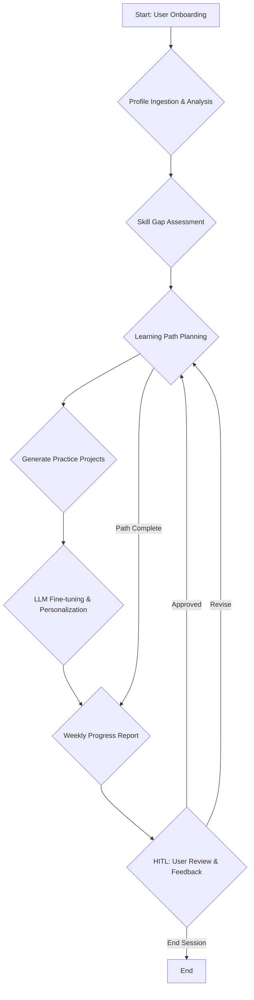

# Personalized AI Learning & Career Coach: Agentic Workflow Architecture

## Assumptions

*   The system will primarily utilize **LangGraph** for orchestrating complex, stateful agentic workflows and **CrewAI** for defining and managing collaborative agent teams within specific tasks.
*   Local LLM fine-tuning and serving will be handled by **Ollama**, requiring a robust integration strategy for both frameworks.
*   The voice interface will necessitate **full-duplex audio communication** and real-time streaming capabilities for a seamless user experience.
*   Human-in-the-Loop (HITL) gates will be implemented at critical junctures to ensure user approval for high-stakes or irreversible actions.
*   The system prioritizes **reliability, debuggability, maintainability, and cost/performance** as core optimization criteria.
*   The architecture will be designed for **production-grade deployment**, implying considerations for scalability, observability, and fault tolerance.

## Recommended Architecture

For the Personalized AI Learning & Career Coach, a **hybrid architecture** is recommended, leveraging **LangGraph for overall workflow orchestration and state management**, and **CrewAI for specialized, collaborative agent execution** within specific tasks. This approach capitalizes on LangGraph's robust state machine capabilities for complex, multi-step processes and CrewAI's strengths in defining role-based agents with clear goals and task handoffs [1] [2].

**LangGraph as the Orchestrator:**
LangGraph will serve as the central control plane, managing the overall flow of the learning coach system. Its graph-based structure is ideal for defining the adaptive learning paths, handling conditional routing based on user progress or skill gaps, and ensuring state persistence across sessions [3]. Key functionalities orchestrated by LangGraph include:
*   **User Profile Ingestion & Analysis:** Initial processing of GitHub, Kaggle, documents, and session notes.
*   **Learning Path Planning:** Dynamic generation and adjustment of week-by-week learning curricula.
*   **Progress Reporting:** Aggregation of metrics and generation of recommendations.
*   **Human-in-the-Loop (HITL) Gates:** Pausing the workflow for user approval or feedback.
*   **Voice Interface Management:** Handling the full-duplex audio flow and integrating speech-to-text/text-to-speech services.

**CrewAI for Specialized Task Execution:**
Within the broader LangGraph workflow, CrewAI will be invoked as a node to execute specific, well-defined tasks that benefit from collaborative agent intelligence. This allows for the creation of specialized "crews" of agents, each with distinct roles, backstories, and tools, to tackle complex sub-problems [4]. Examples include:
*   **Skill Gap Analysis Crew:** Agents specialized in analyzing diverse data sources (GitHub, Kaggle) to identify skill deficiencies against target roles.
*   **Content Curation Crew:** Agents focused on searching, filtering, and summarizing learning resources for the dynamic learning path.
*   **Project Generation Crew:** Agents designed to create tailored, hands-on practice projects based on user's current level and learning objectives.
*   **LLM Fine-tuning & Personalization Crew:** Agents managing the process of fine-tuning the local Ollama-served LLM on user-specific data.

**Integration Points:**
LangGraph will pass context and tasks to CrewAI, and CrewAI will return structured outputs back to LangGraph for further processing or state updates. This clear separation of concerns ensures modularity, maintainability, and scalability. The integration will involve defining CrewAI execution as a custom node within the LangGraph state machine, allowing for seamless transitions between orchestration and collaborative agent work [1].

**Local LLM Integration (Ollama):**
Both LangGraph and CrewAI agents will leverage a locally served Ollama LLM for hyper-personalized responses and cost-effective inference. This involves configuring the respective frameworks to use the Ollama API endpoint, potentially with specific model identifiers for different agent roles or tasks [5].

## Workflow Graph

The core of the Personalized AI Learning & Career Coach will be a **LangGraph state machine**, designed to manage the adaptive and iterative learning process. The graph will define a series of nodes representing distinct stages of the user's journey, with edges dictating the flow based on conditions and outcomes. The state will be persistent, allowing for seamless continuation across sessions and human-in-the-loop (HITL) interventions [3].

**High-Level LangGraph Structure:**



**Key Nodes and Their Functions:**

*   **User Onboarding (Start):** Initiates the process, collecting initial user preferences and target career goals.
*   **Profile Ingestion & Analysis:** Ingests and processes user data (GitHub, Kaggle, documents, notes). This node will likely invoke a CrewAI for detailed analysis.
*   **Skill Gap Assessment:** Compares user skills against target role requirements, identifying deficiencies. This node could also leverage a CrewAI for specialized analysis.
*   **Learning Path Planning:** Generates a dynamic, week-by-week learning path with curated resources. This is a core adaptive component, potentially involving a CrewAI for content curation.
*   **Generate Practice Projects:** Creates hands-on projects tailored to the user's current level. Another potential integration point for a CrewAI.
*   **LLM Fine-tuning & Personalization:** Manages the fine-tuning of the local Ollama-served LLM based on user notes and progress. This node will likely interact with the Ollama service directly or via a dedicated CrewAI.
*   **Weekly Progress Report:** Synthesizes progress metrics, next-step recommendations, and motivational framing.
*   **HITL: User Review & Feedback:** A critical node where the system pauses, presents information to the user, and awaits explicit approval or revision requests. This ensures human oversight for high-stakes decisions.
*   **End Session (End):** Concludes the current learning session.

**Edges and Conditional Routing:**

*   **Conditional Edges:** The flow from `HITL: User Review & Feedback` will be conditional, either looping back to `Learning Path Planning` for revisions or proceeding to `End` if the session is complete.
*   **Loops:** The primary learning loop will involve `Learning Path Planning` -> `Generate Practice Projects` -> `LLM Fine-tuning & Personalization` -> `Weekly Progress Report` -> `HITL: User Review & Feedback`, allowing for continuous adaptation and improvement.
*   **State Management:** LangGraph's state will maintain critical information such as user profile, current learning path, progress metrics, and LLM fine-tuning status. Checkpointing will be used for persistence [3].

## Agent / Crew Design

The system will employ a multi-agent design, with specialized agents and crews collaborating to achieve the personalized learning objectives. LangGraph will orchestrate the high-level workflow, while CrewAI will manage the internal collaboration and execution of specific tasks by agent teams [1] [4].

### LangGraph-Managed Agents (High-Level Nodes)

While LangGraph primarily manages the workflow state and transitions, certain nodes can be conceptualized as high-level agents responsible for overall coordination and decision-making.

*   **Orchestrator Agent (LangGraph State Machine):**
    *   **Role:** Manages the overall learning journey, directs traffic between different stages, and enforces HITL gates.
    *   **Goal:** Ensure the user progresses through an adaptive and effective learning path.
    *   **Tools:** Ability to invoke CrewAI for specialized tasks, manage state persistence, and interact with external interfaces (e.g., voice).
    *   **Handoff Contract:** Receives structured outputs from CrewAI tasks, updates the global state, and determines the next workflow step.
    *   **Failure Mode:** If a CrewAI task fails, the Orchestrator Agent will log the error, potentially retry, or escalate to a HITL gate.

### CrewAI-Managed Crews (Specialized Task Execution)

Each CrewAI instance will consist of a team of agents with defined roles, backstories, and goals, working collaboratively to complete a specific task within a LangGraph node. The `Process.hierarchical` mode in CrewAI is suitable for complex tasks requiring dynamic task routing and supervision [6].

#### 1. Profile Analysis Crew

*   **Goal:** Ingest and analyze user data (GitHub, Kaggle, documents, notes) to create a comprehensive skill profile.
*   **Agents:**
    *   **GitHub Analyst:**
        *   **Role:** Extracts and interprets data from GitHub profiles (repositories, contributions, languages).
        *   **Tools:** GitHub API client, code analysis tools.
        *   **Backstory:** Expert in open-source contributions and software development trends.
    *   **Kaggle Analyst:**
        *   **Role:** Analyzes Kaggle notebooks and competition performance.
        *   **Tools:** Kaggle API client, data science notebook parsers.
        *   **Backstory:** Experienced data scientist with a keen eye for machine learning project evaluation.
    *   **Document Processor:**
        *   **Role:** Extracts key information and concepts from uploaded documents and session notes.
        *   **Tools:** Document parsing libraries (e.g., PDF parsers, NLP libraries).
        *   **Backstory:** Meticulous information extractor and summarizer.
    *   **Profile Synthesizer (Manager Agent):**
        *   **Role:** Oversees the analysis, synthesizes findings from individual agents, and generates a structured skill profile.
        *   **Tools:** Internal knowledge base, structured output generation.
        *   **Backstory:** Senior analyst capable of holistic user assessment.
*   **Handoff Contract:** Outputs a structured JSON object detailing the user's skills, experience, and identified strengths/weaknesses.
*   **Failure Mode:** Incomplete data extraction, misinterpretation of skills. Escalates to Orchestrator for potential re-evaluation or HITL.

#### 2. Skill Gap Assessment Crew

*   **Goal:** Compare the user's skill profile against a target role/technology track to identify specific gaps.
*   **Agents:**
    *   **Role Definition Agent:**
        *   **Role:** Accesses and interprets up-to-date job market data and role descriptions.
        *   **Tools:** Web search, job board APIs.
        *   **Backstory:** Market research specialist with deep understanding of industry demands.
    *   **Gap Analyst:**
        *   **Role:** Compares user profile with role definition, quantifies skill gaps.
        *   **Tools:** Skill taxonomy database, comparison algorithms.
        *   **Backstory:** Analytical expert in competency modeling.
*   **Handoff Contract:** Outputs a prioritized list of skill gaps with associated learning objectives.
*   **Failure Mode:** Inaccurate gap identification. Escalates to Orchestrator.

#### 3. Learning Path Generation Crew

*   **Goal:** Create a dynamic, week-by-week learning path with curated resources based on identified skill gaps.
*   **Agents:**
    *   **Curriculum Designer:**
        *   **Role:** Designs the overall structure and progression of the learning path.
        *   **Tools:** Educational frameworks, learning science principles.
        *   **Backstory:** Experienced educator and instructional designer.
    *   **Resource Curator:**
        *   **Role:** Searches for and evaluates relevant learning resources (courses, articles, videos, books).
        *   **Tools:** Web search, educational platform APIs.
        *   **Backstory:** Knowledgeable librarian and content expert.
    *   **Path Optimizer:**
        *   **Role:** Adjusts the learning path based on user progress, feedback, and time constraints.
        *   **Tools:** Optimization algorithms, user progress tracking.
        *   **Backstory:** Adaptive learning specialist.
*   **Handoff Contract:** Outputs a detailed learning plan, including weekly modules, resources, and estimated time commitments.
*   **Failure Mode:** Irrelevant resources, unachievable timelines. Escalates to Orchestrator or HITL.

#### 4. Project Generation Crew

*   **Goal:** Generate hands-on practice projects tailored to the user's current level and learning path.
*   **Agents:**
    *   **Project Ideator:**
        *   **Role:** Brainstorms project ideas aligned with learning objectives and user's skill level.
        *   **Tools:** Project database, creativity prompts.
        *   **Backstory:** Innovative project manager.
    *   **Specification Writer:**
        *   **Role:** Develops detailed project specifications, including requirements, technologies, and success criteria.
        *   **Tools:** Technical writing guidelines, domain-specific knowledge.
        *   **Backstory:** Precise technical writer.
    *   **Difficulty Adjuster:**
        *   **Role:** Ensures project difficulty is appropriate for the user's current skill level.
        *   **Tools:** Difficulty assessment metrics, adaptive learning models.
        *   **Backstory:** Pedagogical expert.
*   **Handoff Contract:** Outputs a comprehensive project brief, including problem statement, deliverables, and suggested tools/technologies.
*   **Failure Mode:** Projects too easy/hard, irrelevant projects. Escalates to Orchestrator or HITL.

#### 5. LLM Fine-tuning Crew

*   **Goal:** Manage the fine-tuning of the local Ollama-served LLM on the user's notes and progress data.
*   **Agents:**
    *   **Data Preparer:**
        *   **Role:** Cleans, formats, and prepares user notes and progress data for fine-tuning.
        *   **Tools:** Data preprocessing scripts, NLP libraries.
        *   **Backstory:** Meticulous data engineer.
    *   **Fine-tuning Orchestrator:**
        *   **Role:** Manages the fine-tuning process on the Ollama instance, monitors progress.
        *   **Tools:** Ollama API, model training scripts.
        *   **Backstory:** ML Ops specialist.
    *   **Model Evaluator:**
        *   **Role:** Evaluates the performance of the fine-tuned LLM, ensuring hyper-personalization.
        *   **Tools:** Evaluation metrics, test datasets.
        *   **Backstory:** ML researcher.
*   **Handoff Contract:** Confirms successful fine-tuning and provides metrics on personalization improvement.
*   **Failure Mode:** Fine-tuning failure, degraded model performance. Escalates to Orchestrator.

#### 6. Progress Reporting Crew

*   **Goal:** Generate weekly progress reports with metrics, next-step recommendations, and motivational framing.
*   **Agents:**
    *   **Data Aggregator:**
        *   **Role:** Collects and aggregates all relevant progress metrics (completion rates, assessment scores).
        *   **Tools:** Database queries, analytics tools.
        *   **Backstory:** Data analyst.
    *   **Report Generator:**
        *   **Role:** Structures and writes the weekly progress report.
        *   **Tools:** Report generation templates, natural language generation.
        *   **Backstory:** Technical writer.
    *   **Motivational Coach:**
        *   **Role:** Adds motivational framing and personalized encouragement to the report.
        *   **Tools:** Psychological principles, positive reinforcement techniques.
        *   **Backstory:** Behavioral psychologist and coach.
*   **Handoff Contract:** Outputs a well-formatted weekly progress report.
*   **Failure Mode:** Inaccurate reporting, lack of motivation. Escalates to Orchestrator or HITL.

**Agentic Loop (Perceive → Reason → Plan → Act):**

Each agent within a CrewAI crew will follow a variant of the agentic loop:

1.  **Perceive:** Receive input (task, context, observations from other agents).
2.  **Reason:** Analyze the input, consult its internal knowledge and backstory, and determine the best course of action.
3.  **Plan:** Formulate a plan to achieve its goal, potentially breaking it down into sub-tasks.
4.  **Act:** Execute tools, generate output, or delegate to another agent.

This iterative process, combined with clear handoff contracts, ensures efficient and collaborative task completion within each crew.
## Implementation Blueprint

This section outlines a production-ready Python structure for integrating LangGraph and CrewAI, focusing on modularity, clear interfaces, and leveraging the strengths of each framework.

### 1. LangGraph State Definition

The LangGraph state will be a `TypedDict` or Pydantic model, ensuring a clear and auditable schema for the entire workflow. This state will be checkpointed for persistence [3].

```python
from typing import List, Dict, Any, TypedDict, Optional
from langchain_core.messages import BaseMessage

class AgentState(TypedDict):
    user_id: str
    target_role: str
    github_profile_url: Optional[str]
    kaggle_notebooks: List[str]
    uploaded_documents: List[str]
    session_notes: List[str]
    skill_profile: Optional[Dict[str, Any]]  # Output from Profile Analysis Crew
    skill_gaps: Optional[List[Dict[str, Any]]] # Output from Skill Gap Assessment Crew
    learning_path: Optional[Dict[str, Any]] # Output from Learning Path Generation Crew
    practice_projects: Optional[List[Dict[str, Any]]] # Output from Project Generation Crew
    llm_fine_tuning_status: Optional[str]
    weekly_report: Optional[Dict[str, Any]] # Output from Progress Reporting Crew
    user_feedback: Optional[str]
    chat_history: List[BaseMessage]
    # Add other relevant state variables as needed
```

### 2. LangGraph Nodes and Edges

Each major step in the workflow will be a LangGraph node. Nodes that require collaborative agent intelligence will invoke CrewAI. Asynchronous execution will be utilized for concurrent tool calls and non-blocking operations [7].

```python
from langgraph.graph import StateGraph, END
from langgraph.checkpoint.memory import InMemorySaver # For development; replace with persistent storage for production

# Define the graph
workflow = StateGraph(AgentState)

# Define nodes (functions)
# Example node for CrewAI invocation
def call_profile_analysis_crew(state: AgentState) -> AgentState:
    # Initialize and run CrewAI Profile Analysis Crew
    # Pass relevant state variables as inputs to CrewAI tasks
    # Update state with CrewAI output (e.g., skill_profile)
    print("Invoking Profile Analysis Crew...")
    # Placeholder for CrewAI execution logic
    # crew = ProfileAnalysisCrew(user_id=state['user_id'], ...)
    # result = crew.kickoff()
    # state['skill_profile'] = result
    return state

# Add nodes to the workflow
workflow.add_node("profile_analysis", call_profile_analysis_crew)
# ... add other nodes for skill_gap_assessment, learning_path_generation, etc.

# Define edges
workflow.add_edge("start_node", "profile_analysis")
# ... define other edges, including conditional edges for HITL

# Set entry point
workflow.set_entry_point("start_node")

# Compile the graph with a checkpointer for persistence
# app = workflow.compile(checkpointer=InMemorySaver())
```

### 3. CrewAI Integration

Each CrewAI crew will be encapsulated within a Python class, defining its agents, tasks, and process flow. These classes will be instantiated and executed within their respective LangGraph nodes.

```python
from crewai import Agent, Task, Crew, Process
from langchain_openai import ChatOpenAI # Or your Ollama-based LLM client

# Example CrewAI Crew for Profile Analysis
class ProfileAnalysisCrew:
    def __init__(self, user_id: str, github_url: Optional[str], documents: List[str]):
        self.user_id = user_id
        self.llm = ChatOpenAI(model="gpt-4o", api_key="YOUR_OPENAI_API_KEY") # Replace with Ollama client

        self.github_analyst = Agent(
            role="GitHub Analyst",
            goal="Extract and interpret data from GitHub profiles",
            backstory="Expert in open-source contributions and software development trends.",
            llm=self.llm,
            tools=[] # Add GitHub API tool
        )
        # ... define other agents for Kaggle, Document Processing, and a Manager Agent

        self.task_github_analysis = Task(
            description=f"Analyze GitHub profile for user {user_id} at {github_url}",
            expected_output="Structured JSON of GitHub contributions and skills.",
            agent=self.github_analyst
        )
        # ... define other tasks

        self.crew = Crew(
            agents=[self.github_analyst], # Add other agents
            tasks=[self.task_github_analysis], # Add other tasks
            process=Process.hierarchical, # Use hierarchical for complex coordination [6]
            manager_llm=self.llm # Manager LLM for hierarchical process
        )

    def kickoff(self) -> Dict[str, Any]:
        result = self.crew.kickoff(inputs={'user_id': self.user_id})
        return {"skill_profile": result} # Return structured output
```

### 4. Ollama Integration

For both LangGraph and CrewAI, the LLM client will be configured to point to the local Ollama instance. This typically involves setting the `base_url` and `model_name` in the LLM client [5].

```python
from langchain_community.llms import Ollama
from langchain_openai import ChatOpenAI # Example for CrewAI, can be replaced

# For LangGraph nodes directly using an LLM
ollama_llm = Ollama(model="llama2", base_url="http://localhost:11434")

# For CrewAI agents
# Ensure CrewAI agents are configured to use the Ollama client
class CustomOllamaChat(ChatOpenAI):
    # Custom class to adapt Ollama to ChatOpenAI interface if needed by CrewAI
    def __init__(self, model: str = "llama2", base_url: str = "http://localhost:11434", **kwargs):
        super().__init__(model=model, base_url=base_url, **kwargs)

# Then, in CrewAI agent definition:
# self.llm = CustomOllamaChat(model="llama2")
```

### 5. Voice Interface (Full-Duplex)

The voice interface will require real-time streaming of audio and text. LangGraph can manage the state of the conversation, while external services (e.g., WebRTC, Twilio) handle the audio stream [8] [9].

*   **Speech-to-Text (STT):** Real-time transcription of user audio input.
*   **Text-to-Speech (TTS):** Synthesis of agent responses into natural-sounding speech.
*   **LangGraph Stream Mode:** Utilize LangGraph's streaming capabilities to send partial responses to the TTS service as they are generated, enabling a more natural, full-duplex conversation [8].
*   **Asynchronous I/O:** `asyncio` will be crucial for handling concurrent audio streams, STT/TTS processing, and LangGraph execution without blocking the interface [7].

## Failure Handling / HITL

A production-grade system requires robust mechanisms for handling failures and incorporating human oversight.

### Failure Handling & Resilience

*   **Retries:** LangGraph nodes and CrewAI tasks will implement retry logic with exponential backoff for transient errors (e.g., API rate limits, network timeouts).
*   **Fallbacks:** If a specific tool or API fails consistently, agents should have fallback strategies (e.g., if a specific job board API is down, fallback to a general web search).
*   **Guardrails:** Output validation using Pydantic models will ensure that agents produce data in the expected format. If validation fails, the agent can be prompted to correct its output.
*   **Error Taxonomy:** A clear taxonomy of errors (e.g., `ToolExecutionError`, `ParsingError`, `ContextLimitExceeded`) will be defined to allow the Orchestrator Agent to make informed decisions about recovery paths.
*   **Resumability:** LangGraph's checkpointing ensures that if the system crashes, it can resume from the last successful state, preventing data loss and redundant processing [3].

### Human-in-the-Loop (HITL)

HITL gates are crucial for ensuring the quality and safety of the personalized learning experience.

*   **Approval Points:**
    *   **Learning Path Finalization:** Before a new weekly learning path is activated, the user must review and approve it.
    *   **Project Selection:** Users can choose from a list of generated projects or request modifications before starting.
*   **Breakpoints:** LangGraph allows setting breakpoints before or after specific nodes. This feature will be used to pause execution and wait for user input at the defined approval points.
*   **Escalation Logic:** If an agent encounters a situation it cannot resolve (e.g., contradictory information, ambiguous user request), it will escalate to a HITL gate, asking the user for clarification.
*   **Safe Fallbacks:** If the user rejects a proposed learning path or project, the system will fallback to the previous state and re-invoke the relevant CrewAI crew with the user's feedback as additional context.

## Observability / Evaluation

Effective observability and rigorous evaluation are paramount for maintaining a production-grade, reliable, and continuously improving AI learning coach.

### Observability

*   **Logging:** Comprehensive logging will be implemented at various levels:
    *   **Application Logs:** Standard application events, errors, and warnings.
    *   **LangGraph Node Logs:** Entry and exit of each LangGraph node, state changes, and conditional routing decisions.
    *   **CrewAI Agent Logs:** Agent actions, tool invocations, internal reasoning steps (if configured for verbose output), and task handoffs.
    *   **LLM Interaction Logs:** Prompts sent to Ollama, responses received, and token usage.
*   **Tracing:** Distributed tracing will be used to visualize the flow of requests through the LangGraph workflow and into CrewAI tasks. This is crucial for debugging complex multi-agent interactions and identifying bottlenecks.
    *   **LangChain/LangGraph Tracing:** Leverage built-in tracing capabilities to track the execution path, intermediate steps, and tool calls within the graph.
    *   **OpenTelemetry/Custom Tracing:** Integrate with OpenTelemetry for end-to-end tracing across all services, including the voice interface and Ollama.
*   **Metrics:** Key performance indicators (KPIs) will be collected and monitored:
    *   **System Health:** CPU, memory, network usage of the Ollama server and application instances.
    *   **Latency:** Time taken for each LangGraph node, CrewAI task, and overall workflow completion.
    *   **Success Rates:** Percentage of successful learning path generations, project creations, and report deliveries.
    *   **Error Rates:** Frequency and types of errors encountered.
    *   **Token Usage & Cost:** Monitor LLM token consumption for cost optimization.
    *   **User Engagement:** Metrics related to user interaction with the learning coach and voice interface.
*   **Error Taxonomy & Alerting:** A well-defined error taxonomy will enable specific alerts for critical failures, allowing for rapid incident response.
*   **Resumability:** LangGraph's checkpointing mechanism inherently aids observability by providing a snapshot of the system's state at various points, which can be inspected for debugging and recovery [3].

### Evaluation

*   **Task Success:** Define clear metrics for the successful completion of each major task (e.g., a learning path is considered successful if it meets all specified criteria and is approved by the user).
*   **Tool Correctness:** Evaluate the accuracy and reliability of tools used by agents (e.g., GitHub API, Kaggle API, web search).
*   **Safety:** Implement checks to ensure generated content (learning paths, projects, reports) is safe, unbiased, and aligned with ethical guidelines.
*   **Latency:** Measure and optimize the response time of the system, especially for the interactive voice interface.
*   **Cost:** Continuously monitor and optimize the operational cost, primarily driven by LLM inference and potentially API calls.
*   **A/B Testing:** For new features or agent strategies, conduct A/B tests to evaluate their impact on user engagement and learning outcomes.
*   **Regression Checks:** Automated test suites will be developed to ensure that new changes do not introduce regressions in existing functionalities or agent behaviors.
*   **User Feedback Integration:** Formal mechanisms for collecting and analyzing user feedback will be established to drive continuous improvement.
## Optimization Notes

Optimizing the performance and cost-efficiency of the Personalized AI Learning & Career Coach is crucial for its long-term viability and user experience.

### 1. Asynchronous Patterns & Concurrency

*   **`async/await` and `asyncio`:** Leverage Python's `asyncio` library and `async/await` syntax throughout the LangGraph nodes and CrewAI tools, especially for I/O-bound operations like API calls (GitHub, Kaggle, external resources) and interactions with the Ollama LLM [7]. This prevents blocking and allows for concurrent execution of multiple tasks.
*   **Concurrent Tool Calls:** Design CrewAI agents to make concurrent tool calls where appropriate (e.g., searching multiple web sources simultaneously) to reduce overall task completion time [7].

### 2. Caching Strategies

*   **LLM Response Caching:** Implement a caching layer for frequently requested or deterministic LLM responses (e.g., common skill definitions, standard learning resource descriptions). This reduces redundant LLM calls and associated costs/latency.
*   **Tool Result Caching:** Cache results from external API calls (e.g., GitHub profile data, Kaggle notebook analysis) to avoid re-fetching data that hasn't changed.
*   **LangGraph Checkpoint Optimization:** While checkpoints provide persistence, optimize their frequency and granularity to balance recovery capabilities with storage overhead and I/O performance.

### 3. Batching

*   **LLM Request Batching:** Where possible, batch multiple smaller LLM prompts into a single larger request to the Ollama server. This can improve throughput and reduce per-token overhead, especially for models that benefit from larger context windows.
*   **Data Ingestion Batching:** Process uploaded documents or session notes in batches rather than individually, particularly during initial ingestion or periodic updates.

### 4. Token & Cost Trade-offs

*   **Prompt Engineering:** Optimize prompts for conciseness and clarity to reduce token usage without sacrificing output quality. Experiment with different prompt structures and few-shot examples.
*   **Model Selection:** Utilize smaller, more efficient Ollama models for tasks where complex reasoning is not required, reserving larger models for critical reasoning or creative generation tasks.
*   **Context Management:** Implement intelligent context management strategies to keep the LLM's context window focused on relevant information, preventing unnecessary token consumption. This includes summarization of past interactions or filtering of irrelevant historical data.
*   **Tool Use Optimization:** Ensure agents are designed to use tools efficiently, avoiding unnecessary tool calls or redundant information retrieval.
*   **Fine-tuning Efficiency:** Continuously monitor the impact of LLM fine-tuning on performance and cost. Ensure that fine-tuning efforts yield tangible improvements in personalization and efficiency, rather than just increasing operational overhead.
## References

[1] Khatib, M. (2025, August 18). *Combining LangGraph and CrewAI*. Medium. [https://medium.com/@mayadakhatib/combining-langgraph-and-crewai-bf38c719ab27](https://medium.com/@mayadakhatib/combining-langgraph-and-crewai-bf38c719ab27)
[2] myengineeringpath.dev. (2026, March 20). *LangGraph vs CrewAI — Graph Orchestration or Role-Based Teams*. [https://myengineeringpath.dev/tools/langgraph-vs-crewai/](https://myengineeringpath.dev/tools/langgraph-vs-crewai/)
[3] LangChain. *Persistence - Docs by LangChain*. [https://docs.langchain.com/oss/python/langgraph/persistence](https://docs.langchain.com/oss/python/langgraph/persistence)
[4] CrewAI. *Agents - CrewAI Documentation*. [https://docs.crewai.com/en/concepts/agents](https://docs.crewai.com/en/concepts/agents)
[5] Pankaj, P. (2025, April 17). *Building a Dynamic, Parallel Tool-Calling Agent with LangGraph + Ollama*. LinkedIn. [https://www.linkedin.com/pulse/building-dynamic-parallel-tool-calling-agent-langgraph-prabhat-pankaj-wdhxc](https://www.linkedin.com/pulse/building-dynamic-parallel-tool-calling-agent-langgraph-prabhat-pankaj-wdhxc)
[6] Callsphere.tech. (2026, March 16). *CrewAI Process Types: Sequential, Hierarchical, and Consensual Workflows*. [https://callsphere.tech/blog/crewai-process-types-sequential-hierarchical-consensual-workflows](https://callsphere.tech/blog/crewai-process-types-sequential-hierarchical-consensual-workflows)
[7] Benton, D. (2025, April 10). *Async, Parameters and LangGraph — Oh My!*. Medium. [https://medium.com/@danobenton/async-parameters-and-langgraph-oh-my-5a7b9d85f782](https://medium.com/@danobenton/async-parameters-and-langgraph-oh-my-5a7b9d85f782)
[8] Penmatcha, R. *Build a Voice Agent with LangGraph*. Medium. [https://medium.com/@vis_44/build-a-tiny-voice-agent-with-langgraph-part-1-8a3c7fdadf82](https://medium.com/@vis_44/build-a-tiny-voice-agent-with-langgraph-part-1-8a3c7fdadf82)
[9] WebRTC.ventures. (2026, January 22). *Building a Voice AI Agent with Policy Guardrails in Action*. [https://webrtc.ventures/2026/01/building-a-voice-ai-agent-with-policy-guardrails-using-twilio-pipecat-and-langgraph/](https://webrtc.ventures/2026/01/building-a-voice-ai-agent-with-policy-guardrails-using-twilio-pipecat-and-langgraph/)
